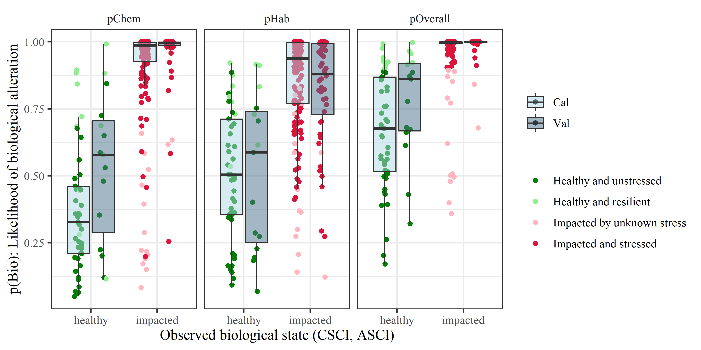
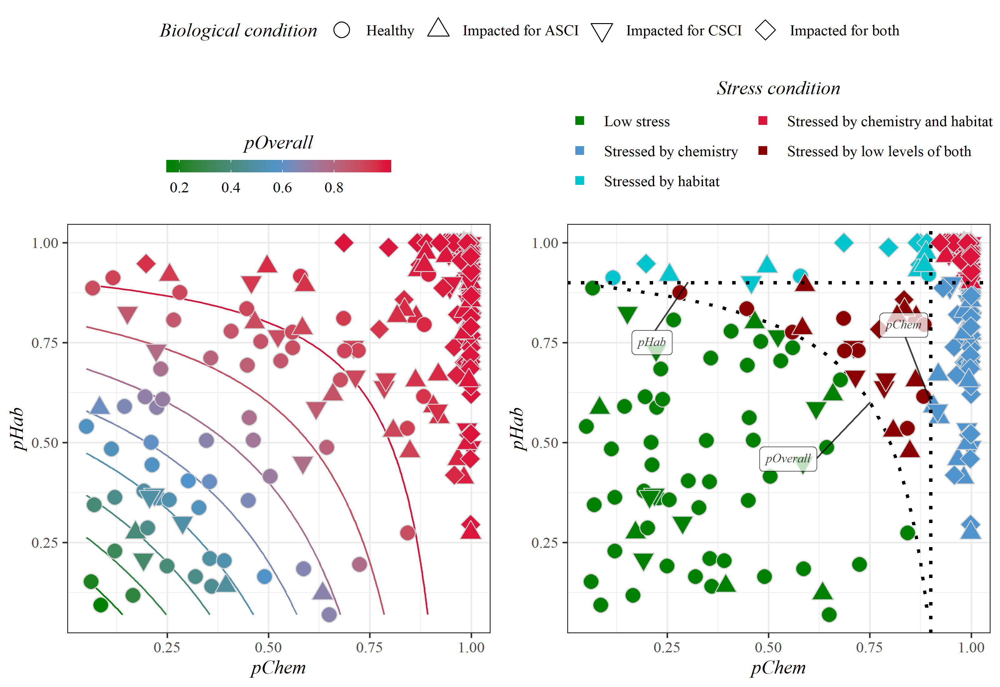

```{r setup, echo = F, warning = F, message = F, results = 'hide'}
# figure path, chunk options
knitr::opts_chunk$set(fig.path = 'figs/', warning = F, message = F, echo = F, cache = T, dev.args = list(family = 'serif'), dpi = 300, warning = F, out.width = '100%', cache.path = 'manu_draft_cache/',
  fig.process = function(x) {
  x2 = sub('-\\d+([.][a-z]+)$', '\\1', x)
  if (file.rename(x, x2)) x2 else x
  })

# libraries
library(Jabbrev)
# devtools::load_all('C:/proj/Jabbrev/.')
library(sf)
library(tidyverse)
library(gridExtra)
library(grid)
library(directlabels)
library(SQI)
# devtools::load_all('L:/SMC SQI_RM/SQI/.')
library(jtools)
library(huxtable)
library(flextable)
library(officer)
library(patchwork)
library(ggalluvial)
library(ggrepel)
library(ggsn)

source('R/funcs.R')

# data
data(sqidat)
data(sqidatinp)
data(sheds)
data(wqglm)
data(habglm)

# extract bib entries from online
bib_scrp('Beck_etal_SQI.Rmd', 'refs.bib', ext_bib = 'https://raw.githubusercontent.com/fawda123/refs/master/refs.bib')

# all colors used for categories
allcol <- getdsccol(palout = T)
```

```{r echo = F, cache = F, eval = F}
spelling::spell_check_files('Beck_etal_SQI.Rmd')
```

# Abstract

Assessment of stream health is a function of the physical, chemical, and biological integrity of the water body. While monitoring of all three indicators of stream quality is commonplace, combining these three indicators into a unified assessment of stream quality is rare, complicating the interpretation of complex environmental health information. In this study, a unified index was developed that combines physical, chemical, and biological indicators for southern California wadeable streams into a scientifically rigorous, easy-to-understand tool intended to facilitate management decision-making. Known as the Stream Quality Index (SQI), this tool is based on a stressor-response empirical model that quantifies the expected likelihood that chemical and physical stressors will impact multiple individual components of biological condition. The index’s chemical parameters, which are indicative of anthropogenic inputs, include nutrients and conductivity; the physical parameters include two physical habitat indices that describe instream (i.e., substrate) condition and stream corridor (i.e., riparian) condition, respectively; and the biological response parameters include biological indices for benthic invertebrates and algae. While the individual stressor and response components are quantitative and have similar meaning across a variety of environmental settings, the final SQI narrative assessment is categorical and designed to be directly actionable within a management decision-making context. The four narrative assessment categories are: (1) "healthy and unstressed" (i.e., unimpacted biology, so protection is recommended); (2) "healthy and resilient" (i.e., stressed, but biological communities are healthy, so reducing stress is recommended); (3) "impacted and stressed" (i.e., impacted biology due to known chemistry and/or physical habitat stressor(s), so remediation or restoration is recommended); and (4) "impacted by unknown stress" (i.e., biology is impacted, so causal assessment is recommended to identify stressors). To facilitate adoption by managers, a web-based application was developed that not only maps overall SQI results, but also enables users to readily access underlying quantitative information for stressors and biological responses to understand likely reasons behind the categorical assessments. This transparent design was intended; high-level output and foundational components of the SQI are relevant for different audiences and details are not sacrificed for accessibility.

# Introduction

Assessments of stream health are a function of monitoring the water body’s physical, chemical, and biological integrity (33 USC §§ 1151, 1972). Monitoring physical habitat integrity facilitates determination of whether all necessary environmental niches are present to support a diverse aquatic community [@Maddock99]. Monitoring chemical integrity facilitates determination of whether toxic compounds are present, as well as whether minerals are sufficiently balanced to support aquatic life [@Wang07;@Maruya16]. Monitoring biological integrity, which is closest to the actual assessment of stream health, facilitates determination of whether unmeasured physical or chemical parameters are impacting otherwise balanced ecosystems [@Stoddard06;@Ode16].

Tremendous management effort is expended annually to monitor all three types of stream integrity indicators. Whether monitoring programs are large and complex or small and straightforward, all share the challenge of how to communicate physical, chemical, and biological data in a scientifically rigorous, repeatable, and readily understandable way to non-scientists [@NRC90]. Because most environmental managers and decision-makers are not scientists, and similarly, scientists may not appreciate the applied context for technical products, the communication of ecological data for decision-making can be challenging. Furthermore, ecological data are rarely black and white, leading to many management decisions made in the "grey zone" [@Paulsen08]. This is particularly true when physical, chemical, and biological lines of evidence are not in complete agreement with one another.

Multiple well-known tools exist for effectively communicating information for a single line of evidence. Bioassessment tools include the Index of Biological Integrity (IBI; @Karr81), Observed to Expected ratios (O/E; @Hawkins00b), and hybrids of the IBI and O/E [@Mazor16]. Chemical assessment tools include the Canadian Council of Ministers of the Environment (CCME) Water Quality Index [@CCME01;@Hurley12]. Physical habitat assessment tools, which are less common, include the California Rapid Assessment Method [@Collins07;@Solek11] and the more recently developed Index of Physical Integrity [@Rehn18].  These established tools have been used as single lines of evidence to separately address chemical, physical, and biological components of the United States CWA.

An assessment tool that combines physical, chemical, and biological indicators into a single unified assessment is exceedingly rare [@Bay12]. Much more commonplace are instances where multiple indicators are individually simplified and presented as a group, leaving managers to decide which is most important [@Paulsen08]. However, a single unified assessment is preferential when communicating stream health to non-technical managers. A single scale provides straightforward context for comparing one site to another, for ranking sites for management actions, and for monitoring improvements at a site following implementation of management actions (or monitoring potential degradation where management actions are not implemented). 

While such a unified assessment tool is possible to develop for use in a single environmental setting, it has long been a challenge to design a technically robust tool that produces assessments that have similar meanings in different environmental settings, that provides clues as to which indicator(s) are impacted and thus need to be remediated, and that can be replicated elsewhere. The goal of this study was to develop a tool that meets all three criteria.  Because biological indicators provide direct measures of aquatic life, while physical and chemical measures provide ancillary information about the stressors that may affect aquatic life, this study sought to develop a method for combining the three indicators in a way that would preserve the types of information provided by each line of evidence.  This is fundamentally different than treating indicators as equivalent lines of evidence and simply "averaging" results to assess overall condition. 

# Methods

## General Approach

The conceptual approach used in this study is based on a stressor-response relationship between biology and in-stream stressors (Figure \@ref(fig:sqiflo)). Specifically, the underlying stressor-response relationships that define the final narrative categories for overall stream condition are based on empirical models that quantify an expected likelihood of chemical or physical stressors impacting the separate components of biological condition. Southern California wadeable streams were selected as the focus of this effort because of the extensive and varied levels of stress and biological impacts. Moreover, southern California is home to many environmental managers with a variety of backgrounds and experience in technical and policy issues.  

Biological response components were selected based on bioassessment indices developed for California wadeable streams (i.e., benthic macroinvertebrates, algae).  Water chemistry stressors were selected that are strongly associated with biological condition in perennial streams (i.e., nutrients, conductivity). Physical habitat metrics were selected that quantify flow, channel, and riparian condition observed at a site. 

The four narrative assessment categories were defined in a way that would align with management decision-making processes. The SQI web-based application was designed in a way that would give users easy access to descriptions of the biological, chemical, and physical components that underlie the unified assessment, depending on the desired level of information within the stressor-response paradigm. 

## Biological response components of the SQI

### Characterizing biological condition

To characterize biological condition, a pair of quantitative bioassessment indices – for benthic macroinvertebrates (BMI) and algal communities, respectively – were used that have been developed for California streams [@Mazor16;@Therouxip]; the indices were treated as complementary lines of evidence in the SQI. 

The California Stream Condition Index (CSCI, @Mazor16) is a predictive index that compares observed benthic macroinvertebrate taxa and metrics at a site to those expected under least disturbed reference conditions (sensu @Stoddard06). Expected values at a site are based on models that estimate the likely macroinvertebrate community relative to factors that naturally influence biology [@Moss87;@Cao07]. 

The Algal Stream Condition Index (ASCI, @Therouxip) was similarly developed as a response endpoint for lower trophic levels; the ASCI is a non-predictive multi-metric index (i.e., it uses a uniform, statewide reference expectation) that incorporates both diatoms and soft-bodied algae. Scores for both indices can range from 0 to ~ 1.4, with a score of 1 at sites in reference condition and lower values indicating biological degradation. Both indices are used as standard assessment measures for perennial wadeable streams in California.

Index scores were compared to the distribution of scores at reference sites to identify biological condition classes that described the likelihood of biological alteration. For both the CSCI and ASCI, the 1st, 10th, and 30th percentiles of scores at reference sites were used to categorize sites as very likely to have altered biological condition (scores less than the 1st percentile), likely altered (scores between the 1st and 10th percentile), possibly altered (scores between the 10th and 30th percentiles), and likely intact (scores greater than the 30th percentile) (Table \@ref(fig:biocmb)). This produced four classes for each index, such that each site had two categories describing separate lines of evidence of the likelihood of biological alteration in the benthic macroinvertebrate and algal communities. Both lines of evidence were jointly considered in the calculation of the SQI for evaluating overall biological condition, described below. Analysis of multiple assemblages provides a more comprehensive indication of biological condition that can confirm overall stream health, and may also provide additional diagnostic information about stressors (as different communities may respond to different characteristics of stream habitat).


### Integrating multiple measures of biological condition 

The assigned biological condition categories for each index were combined using a ranking system to create a single numeric value that represented an overall condition reflected by both biological indices. These values were assigned based on the judgment of stakeholders, in accordance with two principles. First, the two indices should be independently applicable, so that an indication of good health in one index cannot negate indications of poor health in the other. Second, the numeric values should be sensitive to differences between sites in marginal or extreme conditions. For example, the numeric value for a sample where both indices indicate likely intact biological communities will be higher than for a sample where one index indicates likely intact and the other indicates possibly altered. This sensitivity improves detection of small changes in condition. The final numeric values ranged from -6 to +5 (Table \@ref(tab:biocmb)). All negative values indicate impacted conditions.

## Stressor components

### Characterizing stress

Water chemistry and physical habitat measurements, which were used to describe stressors associated with low CSCI and ASCI scores [@Mazor15;@Therouxip], have a conceptual relationship with both invertebrate and algal assemblages [@Richards97;@Pan02;@Wang07]. Depending on the context, physical habitat can be considered a response metric of stream health. However, physical habitat herein is considered a stressor that can affect biological condition at different taxonomic levels within the stressor-response model.

The water chemistry indicators consisted of nutrients - specifically, total nitrogen (mg/L) and total phosphorus (mg/L) - and specific conductivity ($\mu$S/cm).  Nitrogen, phosphorus, and conductivity are widely measured in many regional and statewide monitoring programs, and collectively act as surrogates for unmeasured or alternative water quality problems at a site (e.g., temperature, light penetration).  Although other contaminants that can affect aquatic organisms are sometimes measured (e.g., metals, pesticides, pharmaceuticals), observations can be sparsely distributed in the study region [@Mazor15] and contaminants often co-occur with elevated nutrients or specific conductivity.  As such, the selected indicators are an effective proxy for stressors that are in the minority of water quality data available for southern California streams. 

Physical habitat conditions at a site were quantified using two indices of habitat condition developed for California water bodies: the Index of Physical-Habitat Integrity (IPI; @Rehn18) and the California Rapid Assessment Method (CRAM) for riverine wetlands [@Collins07;@Solek11]. Although IPI and CRAM scores can be correlated, both were included in the SQI because they provide unique information about physical habitat; IPI scores better describe instream condition and CRAM scores better describe riparian condition.

The IPI is an O/E index [@Hawkins00b]based on physical habitat metrics (PHAB, [@Rehn18]) that collectively characterize five components of in-stream habitat quality: percent sands, fines, or concrete, Shannon diversity of aquatic habitat types, Shannon diversity of natural substrate types, evenness of flow habitat types, and riparian vegetation cover. All five metrics are positively associated with physical habitat integrity, such that an increase in each was generally considered an improvement in site condition (percent sands and fines is inversely scored). All physical data used to calculate these metrics were collected using standard field protocols described in @Ode07, which are derived from protocols used in national assessments [@USEPA16]. As with the CSCI, the IPI is a predictive index, and values for most metrics are compared to site-specific expectations appropriate for the stream's environmental setting. The IPI ranges from 0 to ~1.4, with values less than 1 indicating departure from reference conditions.

In contrast to the IPI, CRAM is based on qualitative assessments of four attributes of riparian wetland function: landscape and buffer condition, hydrologic condition, physical structure, and biotic structure. Whereas the data for the IPI is derived from numerous quantitative measurements of physical habitat components collected along several transects, CRAM attributes are assessed on a whole-reach scale through visual observation. In general, CRAM characterizes larger-scale processes affecting stream condition both within and adjacent to the stream corridor, whereas the IPI focuses more narrowly on in-stream conditions. CRAM scores range from 25 to 100, with higher values indicating less degraded conditions at a site.

### Integrating multiple measures of stress

The combined impact of habitat or chemistry stressors on biological condition was evaluated by developing stress-response models that calculate the probability of observing poor biological conditions given observed levels of chemical or habitat stress. This approach eliminates the need to identify potential thresholds for identifying high levels of stress while also accounting for their combined impacts.

For both types of stress, a generalized linear model [@Fox11] was fit to calibration data to quantify associations for each separate water quality or physical habitat measure with binomial categories for altered or unaltered biology. Two models were developed:

\begin{equation}
pChem: p\left(bio\right) \sim \beta_{0} + \beta_{1}TN + \beta_{2}TP + \beta_{3}cond
(\#eq:pchem)
\end{equation}

\begin{equation}
pHab: p\left(bio\right) \sim \beta_{0} + \beta_{1}CRAM_{blc} + \beta_{2}CRAM_{ps} + \beta_{3}IPI_{PCT\_SAFN}
(\#eq:phab)
\end{equation}

where $p\left(bio\right)$ is the probability of biological alteration in equations \@ref(eq:pchem) and \@ref(eq:phab) given the indicators for each chemistry or physical habitat variable.  The probability of alteration is modelled using a logit link function for binomial variables, as $log\left(p / \left(1 - p\right)\right)$, where $p$ defines the presence or absence of altered biology described above.  Both models were created by screening collinear predictors by removing those with variance inflation factors (VIF) greater than three [@Zuur07].  The most parsimonious model was then identified using backward and forward selection to minimize Akaike Information Criterion [@Akaike73;@Venables02]. The selected variables for each model are shown above (equation \@ref(eq:pchem), TN: total nitrogen, TP: total phosphorus, cond: specific conductivity; equation \@ref(eq:phab), CRAM$_{blc}$: CRAM buffer landscape condition, CRAM$_{ps}$: CRAM physical structure, IPI$_{PCT\_SAFN}$: IPI \% sands and fines).

An overall likelihood of biological alteration from both chemistry and physical habitat stressors was also estimated as a multiplicative function for $pChem$ and $pHab$:

\begin{equation}
pOverall: p\left(bio\right) \sim 1 - \left(\left(1 - pChem \right) \times \left(1 - pHab\right)\right)
(\#eq:poverall)
\end{equation}

The inverse of the likelihoods was used to represent an additive effect of both chemistry and physical habitat stressors.  Equations \@ref(eq:pchem), \@ref(eq:phab), and \@ref(eq:poverall) provided the empirical estimates of biological alteration that were used to define the categorical outputs of the SQI, defined below. 

## Combining stress and response measures into the final SQI assessment

The empirical framework for the binomial models and combined biological condition categories established a basis for the categorical descriptions from the SQI output.  These descriptions linked the quantitative data to management actions, such that the results were easily interpreted with an indication of biological condition and the relevant stressors which may or may not be related to condition.  For the components in Figure \@ref(fig:sqiflo), categorical outputs are provided by the index for the overall SQI, the biological condition, and the stress condition (Figure \@ref(fig:sqicat)).  The categorical outputs were created from a matrix combination of the respective inputs.  

The overall SQI assessment categories describe four possible combinations of biology and stressors at a site from the binary categories of altered/unaltered biology and stressed/unstressed conditions: (1) healthy and unstressed, (2) healthy and resilient, (3) impacted by unknown stress, and (4) impacted and stressed.  

Separate categorical outputs were also created for the biological condition and stressor condition categories. The four possible outputs for the biological categories were based on the four combinations from the binary categories of high/low CSCI and high/low ASCI: healthy, impacted for CSCI, impacted for ASCI, and impacted for both.  The possible stressor condition categories for a site were based on the four outcomes of the binary combinations of high/low chemistry stress and high/low physical habitat stress: low stress, stressed by chemistry, stressed by habitat, and stressed by both. A fifth stress category was also possible based on the additive combinations of low chemistry and low habitat stress (i.e., if $pOverall$ exceeded the threshold even though $pChem$ and $pHab$ did not). Thresholds for biological indices that defined high/low condition were based on the tenth percentile distribution of scores at reference sites for each index.  Thresholds for low/moderate/high stress were based on 10\% ad 90\% likelihoods of observing a biological impact.

## Calibration and validation of the SQI

All data used to calibrate and validate the SQI were from the Southern California Stormwater Monitoring Coalition (SMC) regional watershed monitoring program in coastal southern California [@Mazor15]. The SMC dataset represents the most comprehensive source of wadeable stream data in southern California. Because the SQI requires synoptic biological, chemistry, and physical habitat data, the final dataset used for model calibration represents only the subset of the SMC dataset where all three components were simultaneously collected. Made up of 266 sites – 75\% of which were used for model calibration – this subset includes sampling dates ranging from 2009 to 2016, with relatively even distribution of samples between years. Most sample events occurred between May and June following standard protocols for perennial stream surveys [@Ode07]. Only one sample event for each site was considered. 

The SQI was evaluated for precision (i.e., how well the underlying empirical model described the likelihood of biological alteration) and sensitivity (i.e., how sensitive the model output is to changing thresholds that define the categorical conditions). The first analysis evaluated precision in the validation dataset to determine agreement between the model and actual stress and biological conditions. For the second analysis, two critical decisions points that affected the model output and categorical results of the SQI were varied to evaluate changes on overall site counts in each final SQI category.  In Table \@ref(tab:biocmb), all sites with combined values greater than or equal to zero were considered healthy and those less than zero were considered impacted.  The effect of varying the cutoff point for healthy and impacted biology was analyzed by comparing changes in the SQI assessment categories at different levels from -6 (all healthy) to 6 (all unhealthy).  Changes in the threshold for the likelihood of observing altered biology that defined the categorical results were also evaluated.

## Selected case studies

SQI results for two examples were explored in detail to provide a narrative description of how the index can be used to inform management of water quality in perennial streams.  The first example describes SQI results in an urban channel with impacted biology (County of Orange) to complement a previous causal assessment study to identify potential stressors of low CSCI scores.  The second example describes a natural channel with impacted biology but low stress that is highlighted in a [draft regional basin plan](https://www.waterboards.ca.gov/sandiego/water_issues/programs/basin_plan/bio_objectives/doc/R9_Biological_Objectives_Staff_Report_Feb2019.pdf) for biological objectives for the San Diego region. Both examples demonstrate how the SQI can be used in the context of existing, site-specific information to support management.

# Results

## SQI patterns

Among all sites, the overall SQI categorized a majority of sites as having altered biology under high stress conditions (impacted and stressed, 71\% of sites, Table \@ref(tab:sqicnt)).  Almost 20\% of sites were in the opposite category of unaltered biology in low stress conditions (healthy and unstressed).  For the remaining two categories of the overall SQI, only 3\% had unaltered biology but were under high stress conditions (healthy and resilient), whereas 6\% sites had altered biology not related to physical or chemical stressors (impacted by unknown stress).  

For the biological condition category, sites with altered conditions were more often altered for both CSCI and ASCI scores (50\%).  For sites with one low-scoring index, more sites were altered for the ASCI (16\%) than the CSCI (11\%).  Less than a quarter of all sites had unaltered biology (23\%).  

For stress conditions, 40\% of sites were stressed by both chemistry and physical habitat stressors.  More sites were stressed by water chemistry (22\%) than physical habitat degradation (5\%) if only one stressor was present.  Over 25\% of sites had low stress, and 8\% of sites were stressed by the additive effect of both low chemistry and physical habitat stressors.    

Spatial patterns among SQI categories in southern California generally followed elevation and land use gradients (Figure \@ref(fig:sqimap)).  More altered biological communities and high stress conditions were observed toward coastal areas in the lower watersheds where urbanization is highest (e.g., Los Angeles, Orange County, Ventura, San Diego).  Sites with altered biological condition showed similar spatial patterns as the overall SQI, although sites altered only for the ASCI were more often observed at mid-elevation across the study region, whereas sites altered only for the CSCI were more common at higher elevation areas in central and northern areas of the study region. Stress condition patterns were similar to biology, although low stress conditions also occurred at higher elevation areas in each watershed.  This produced a handful of sites that had altered biology under low stress conditions at mid-elevation ranges (i.e., impacted by unknown stress, Table \@ref(tab:sqicnt)).    

```{r eval = T, echo = F}
pchemn <- sum(sqidat$pChem > 0.5) 
pchemp <- round(100 * sum(sqidat$pChem > 0.5) / nrow(sqidat), 0)

phabn <- sum(sqidat$pHab > 0.5) 
phabp <- round(100 * sum(sqidat$pHab > 0.5) / nrow(sqidat), 0)

poveralln <- sum(sqidat$pChemHab > 0.5) 
poverallp <- round(100 * sum(sqidat$pChemHab > 0.5) / nrow(sqidat), 0)
```

## Model precision

```{r}
pchemchk <- lm(pChem ~ bio_fp * SiteSet, data = sqidat)
phabchk <- lm(pHab ~ bio_fp * SiteSet, data = sqidat)
poverallchk <- lm(pChemHab ~ bio_fp * SiteSet, data = sqidat)

ttst <- sqidat %>% 
  st_set_geometry(NULL) %>% 
  filter(SiteSet %in% 'Val') %>% 
  dplyr::select(pChem, pHab, bio_fp) %>%
  gather('var', 'val', -bio_fp) %>% 
  mutate(bio_fp = factor(bio_fp, levels = c(0, 1), labels = c('healthy', 'impacted'))) %>% 
  group_by(var) %>% 
  nest %>% 
  mutate(
    tst = purrr::map(data, function(x){
      
      tst <- with(x,
        t.test(val[bio_fp == 'impacted'], val[bio_fp == 'healthy'])
      )
      
      out <- paste0('t = ', round(tst$statisti, 2), ', df = ', round(tst$parameter, 2), ', ', p_ast(tst$p.value))
      
      return(out)
      
    })
  ) %>% 
  dplyr::select(-data) %>%
  deframe

```

The distinction between healthy and impacted biological communities was well-described by the estimated likelihood of biological alteration provided by the empirical models (Figure \@ref(fig:boxlik)).  Slightly larger differences between the likelihood of alteration for healthy and impacted communities were observed for the chemistry model compared to the physical habitat model, suggesting an improved fit for the former (for healthy/impacted communities at validation sites, `r ttst$pChem` for *pChem*; `r ttst$pHab` for *pHab*).  For the overall likelihood of biological alteration (*pOverall*), more sites were greater than 90\% likely to be altered in the impacted category as compared to the separate *pChem* and *pHab* models. For all cases (*pChem*, *pHab*, *pOverall*), there were no systematic differences in model results between calibration and validation datasets ($p >$ 0.05 for the interaction and fixed effect of site type in linear models describing likelihood of alteration between impact categories and site type). 

The underlying empirical models provided insight into instream characteristics that were related to the likelihood of biological alteration (Figures \@ref(fig:strlik), \@ref(fig:rspcrv)).  About `r pchemp`\% of sites (n = `r pchemn`) had greater than 50\% likelihood of biological alteration from water chemistry stressors, and `r phabp`\% (n = `r phabn`) had greater than 50\% likelihood of biological alteration from physical habitat stressors (Figure \@ref(fig:strlik)).  Collectively, `r poverallp`% (n = `r poveralln`) of sites had greater than 50\% likelihood of biological alteration from the overall stress of both chemistry and physical habitat stressors. 

```{r}
calset <- sqidat %>% 
  filter(SiteSet %in% 'Cal')
crhab <- cor.test(calset$IPI, calset$indexscore_cram) %>% 
  .$estimate %>% 
  round(2)

habglmsub1 <- glm(bio_fp ~ indexscore_cram,
              family = binomial('logit'), data = calset)
habglmsub2 <- glm(bio_fp ~ IPI,
              family = binomial('logit'), data = calset)
```

Water chemistry and physical habitat predictors included in the empirical response models for *pChem* and *pHab* (equations \@ref(eq:pchem), \@ref(eq:phab)) explained a substantial portion of variability among sites related to the occurrence of biological alteration (Table \@ref(tab:strmod)). The *pChem* model explained 64\% of the variation among sites, whereas the *pHab* model explained 42\%.  All variables in the *pChem* model had VIF values less than 3 and were also included in the final set of predictors after model selection.  All predictors in the *pChem* model were significantly and positively associated ($p < 0.05$) with the occurrence of biological alteration.  For the *pHab* model, three predictors were removed that had VIF values greater than three (diversity of natural substrate, biological structure, and hydrology).  Predictors included in the final *pHab* model after variable selection were buffer and landscape condition, physical structure, and percent sands and fines.  All predictors were negatively associated with the likelihood of biological alteration, whereas buffer landscape condition had the only significant association.   

Figure \@ref(fig:rspcrv) demonstrates how the individual components for each stressor model were related to likelihood of alteration.  These partial dependency plots were created by estimating the likelihood of alteration across a range of values for each predictor, while holding other predictors constant.  For each plot, the variables in each model (equations \@ref(eq:pchem), \@ref(eq:phab)) not on the x-axis were held at approximate values that were associated with low stress to better understand how biological alteration may be related to each predictor.  For water chemistry stressors, all were positively associated with likelihood of alteration, particularly conductivity which had the steepest per-unit increase in likelihood.  Associations of biological alteration with physical habitat predictors were also as expected, except that decreases in likelihood of biological alteration were observed with increases in the three predictors (all are associated with habitat integrity).  The strongest relationship was observed with increases in CRAM buffer landscape condition, where likelihood of alteration decreased sharply with scores greater than 60. 

## Model sensitivity to biological decision points

Results in Figure \@ref(fig:snsfig) show changes in the the categorical results based on different decision points that defined biological condition and stress thresholds.  As a general trend, lowering the cutpoint for healthy/impacted to designate more sites as healthy (-6) caused in increase in the amount of sites as "low stress" for the stress condition and sites as "healthy and unstressed" or "impacted by unknown stress" for the overall SQI.  Conversely, increasing the cutpoint for healthy/impacted to designate more sites as impacted (-6) caused in increase in the amount of sites as "stressed by chemistry and habitat" for the stress condition and sites as "impacted and stressed" or "health and resilient" for the overall SQI.  

Changing the threshold for the likelihood values that defined stressed biology also affected the categorical results (Figure \@ref(fig:snsfig), bottom row). Higher thresholds shifted the number of sites to low stress conditions, whereas lower thresholds had the opposite effect of assigning more sites to high stress conditions.  The number of sites that were stressed by low levels of both water chemistry and habitat conditions were relatively unchanged with different thresholds. The overall SQI categories were less affected by changing thresholds for the stress condition than for changing the cutpoint that defined healthy/impacted biology.  However, higher thresholds shifted some sites from the impacted and stressed category to the impacted by unknown stress category and from the healthy and resilient category to the healthy and unstressed category.

## Case study results

### San Diego Creek

San Diego Creek is a coastal stream in the County of Orange (33.689722N, -117.821853W) that drains the San Joaquin Hills and Loma Ridge into the Newport Bay estuary.  The watershed is heavily urbanized and most of the creek has been engineered for flood control as a concrete-lined or reinforced channel with no natural riparian structure. The creek is designated for aquatic life (wildlife and warmwater habitat) and recreational (contact and non-contact) uses under the county's water quality control plan.  Bioassessment results from the CSCI have shown that the structure and function of macroinvertebrate communities is very likely altered from regional reference conditions (Figure \@ref(fig:exsfig)a).  

```{r}
sdc_sites <- sqidat %>% 
  filter(MasterID %in% c("SMC00766", "801S03971", "801M12649", "SMC06019", "SMC01923"))
sdc_ascirng <- sdc_sites$ASCI %>% 
  range %>% 
  round(2)
sdc_cscirng <- sdc_sites$CSCI %>% 
  range %>% 
  round(2)
sdc_tn <- sdc_sites$TN %>% 
  mean %>% 
  round(1)
sdc_tp <- sdc_sites$TP %>% 
  mean %>% 
  round(1)
sdc_cond <- sdc_sites$Cond %>% 
  mean %>% 
  round(0)
sdc_cram <- sdc_sites$indexscore_cram %>% 
  mean %>% 
  round(0)
sdc_ipi <- sdc_sites$IPI %>% 
  mean %>% 
  round(2)
sdc_tnqnt <- ecdf(sqidat$TN)(sdc_tn) %>% perc_suff
sdc_tpqnt <- ecdf(sqidat$TP)(sdc_tp) %>% perc_suff
sdc_condqnt <- ecdf(sqidat$Cond)(sdc_cond) %>% perc_suff
sdc_cramqnt <- ecdf(sqidat$indexscore_cram)(sdc_cram) %>% perc_suff
sdc_ipiqnt <- ecdf(sqidat$IPI)(sdc_ipi) %>% perc_suff
```

The dataset used to develop the SQI included five sites on San Diego Creek with one sample in 2010, three in 2011, and one in 2016. Biological condition at these sites was poor with ASCI scores ranging from `r sdc_ascirng[1]` to `r sdc_ascirng[2]` and CSCI scores ranging from `r sdc_cscirng[1]` to `r sdc_cscirng[2]`.  All sites were impacted for both CSCI and ASCI scores. The SQI stressor condition for all five sites indicated nearly a 100\% likelihood of chemistry and physical habitat stressors impacting biology, with a 100\% likelihood of overall stress based on the combined effects of both.   Average total nitrogen, total phosphorus, and conductivity were `r sdc_tn` mg/L, `r sdc_tp` mg/L, and `r sdc_cond` $\mu$S/cm, placing the creek in the `r sdc_tnqnt`, `r sdc_tpqnt`, and `r sdc_condqnt` percentiles for water chemistry, respectively, among all sites in the complete dataset.  Similarly, CRAM and IPI scores averaged across sites were `r sdc_cram` and `r sdc_ipi`, placing the creek in the `r sdc_cramqnt` and `r sdc_ipiqnt` percentiles for the region.  The overall SQI category for all five sites was "impacted and stressed" (Figure \@ref(fig:exsfig)a).

An independent causal assessment study was conducted in 2018 to determine the causes of biological impairment in San Diego Creek (Shibberu et al. in review). A detailed description of causal assessment is beyond the scope of this paper, although in short, causal assessment is a formalized approach using multiple lines of evidence to characterize stressors as likely, unlikely, or indeterminate causes for the biological condition observed in a system [@Norton14;@Schiff15].  This differs from the SQI approach where the stressors are based on association alone.  For San Diego Creek, the potential stressors that were evaluated included sediment accumulation, channel engineering, nutrients, temperature, conductivity, and pesticides.  The causal assessment concluded that sediment accumulation and elevated water temperature resulting form channel alteration, combined with sediment-bound pesticices, were the most likely causes of low CSCI scores.  Alternatively, nutrients, although elevated, were evaluated as not likely. The lack of a causal link between nutrients and biological condition may be related to the assessment's focus on CSCI scores as its biological endpoint and that sufficient algal data were unavailable at the time (ASCI scores were not evaluated).  As such, the SQI results are supported by causal assessment, with the latter providing a more comprehensive evaluation of links between stressors and biological condition and insight into potential sources of the stressors.

### San Juan Creek

San Juan Creek is located in the County of Orange (33.606546N, -117.446041W) and drains a larger watershed compared to San Diego Creek.  San Juan Creek originates in the Santa Ana mountains that are largely undeveloped, whereas lower portions of the creek are engineered for flood control in the urbanized areas of the watershed. The upper portion of San Juan Creek was described in a regional basin plan (San Diego Regional Water Quality Control Board) as not attaining aquatic life uses because CSCI scores were lower than the tenth percentile of scores observed at reference sites.  However, both physical habitat and water chemistry parameters at the assessment site suggested conditions were adequate to support biotic integrity.  Toxicity tests also showed 100\% survival of *Ceriodaphnia dubia*, providing evidence that toxicity was not a likely stressor impacting biology at the site.

```{r}
cs2_site <- sqidat %>% 
  filter(MasterID %in% c("901S00313"))
cs2_asci <- cs2_site$ASCI %>% 
  round(2)
cs2_csci <- cs2_site$CSCI %>% 
  round(2)
cs2_tn <- cs2_site$TN %>% 
  round(1)
cs2_tp <- cs2_site$TP %>% 
  round(1)
cs2_cond <- cs2_site$Cond %>% 
  round(0)
cs2_cram <- cs2_site$indexscore_cram %>% 
  round(0)
cs2_ipi <- cs2_site$IPI %>% 
  round(2)
cs2_tnqnt <- ecdf(sqidat$TN)(cs2_tn) %>% perc_suff
cs2_tpqnt <- ecdf(sqidat$TP)(cs2_tp) %>% perc_suff
cs2_condqnt <- ecdf(sqidat$Cond)(cs2_cond) %>% perc_suff
cs2_cramqnt <- ecdf(sqidat$indexscore_cram)(cs2_cram) %>% perc_suff
cs2_ipiqnt <- ecdf(sqidat$IPI)(cs2_ipi) %>% perc_suff
cs2_chstr <- cs2_site$pChem %>% `*`(100) %>% round(0)
cs2_habstr <- cs2_site$pHab %>% `*`(100) %>% round(0)
cs2_overallstr <- cs2_site$pChemHab %>% `*`(100) %>% round(0)
```

The SQI results for the sampling station in the upper San Juan Creek confirmed the above results by categorizing the site as "impacted by unknown stress" (Figure \@ref(fig:exsfig)b).  The CSCI score at the site is `r cs2_csci`, whereas the ASCI score is close to reference conditions at `r cs2_asci`; the biological condition category for the SQI indicates the site is impacted for the CSCI only.  The likelihood of biological alteration was estimated as `r cs2_chstr`\% from chemistry stress and `r cs2_habstr`\% from physical habitat stress, with a combined likelihood of `r cs2_overallstr`\% from overall stress. Total nitrogen, total phosphorus, and conductivity were `r cs2_tn` mg/L, `r cs2_tp` mg/L, and `r cs2_cond` $\mu$S/cm, placing the site in the `r cs2_tnqnt`, `r cs2_tpqnt`, and `r cs2_condqnt` percentiles for water chemistry, respectively, among all sites.  Similarly, CRAM and IPI scores were `r cs2_cram` and `r cs2_ipi`, placing the creek in the `r cs2_cramqnt` and `r cs2_ipiqnt` percentiles for the region.  As such, initial results suggest that neither chemistry nor physical stressors are impacting biological condition and a formal causal assessment at the site may be needed to identify additional stressors that may be impacting the aquatic life use.   

# Discussion

The Stream Quality Index offers a solution for watershed managers seeking to synthesize large amounts of physical, chemical, and biological data about stream health. Using the SQI, users can both recognize large-scale patterns in data from multiple lines of evidence, and improve how the data are communicated to high-level, non-technical environmental managers. This need is particularly pressing in regions like southern California, where large-scale landscape alteration and competing demands for water usage require managers to prioritize limited resources and management actions. As shown via the application of the SQI to stream data from the southern California, this tool can be used to prioritize sites for restoration, protection, and other management activities on a large scale. 

While the simplest way to synthesize three lines of evidence would be to treat them equivalently and simply "average" the results, this approach would mask the types of information provided by each, and ultimately could not effectively characterize situations where these indicators disagreed – a common situation in the SMC data set. To properly capture relationships among indicators of stream quality in a way that is consistent with conceptual modeling of a healthy stream ecosystem, it was crucial to develop an index that accurately reflects biology’s role as a direct measure of condition, and that reflects physical and chemical indicators as measures of stress. In other words, a finding of good water chemistry should not obscure or distort an indication of poor biology, and vice versa. 

As a categorical index, the SQI provides a readily interpretable description of stream conditions that is easily accessible though a web-based application. The four condition categories defined by the index (i.e., healthy and unstressed, healthy and resilient, impacted and stressed, impacted by unknown stress) can be understood by a general audience that may not need the underlying data and tools used to analyze them. In contrast, numeric indices require a benchmark or other appropriate context to interpret scores; without this information, it can be difficult to identify which values of a numeric index correspond to healthy conditions requiring protection, and which values correspond to impacted conditions requiring intervention.  Defining the condition categories from empirical models that are ultimately linked to continuous data provided a quantitative link between the two.

The SQI also addresses the challenge of synthesizing large amounts of information about stream condition without losing the individual components, which are readily available to the user for more in-depth exploration because the index is hierarchical. This provides a critical service by allowing users to identify likely reasons behind the categorical classification for a given site. In other words, users can determine which biological indicators account for a stream's health rating, along with which stressors may or not be associated with biological condition.  Users also can identify presence or absence of physical and/or chemical stressors, and which components in equations \@ref(eq:pchem) and \@ref(eq:phab) may be linked to their respective stressor categories.  Further, physical habitat measures (i.e., CRAM and IPI) include component metrics that can serve as additional diagnostic information to describe physical conditions (e.g., percent sands and fines, shading, diversity of natural substrates, etc.).  An evaluation of component metrics for sites that are stressed by physical habitat may reveal which stream characteristics could be prioritized to improve condition (e.g., reduce bank erosion or increase riparian cover).

Because the SQI approach to characterizing stressors differs from similar past efforts, the SQI is well-suited for use with ambient monitoring programs.  For example, the Canadian Water Quality Index (CWQI, @CCME01, @Hurley12) is a similar tool that evaluates the scope, frequency, and amplitude  of water quality objective exceedances for numerous parameters, resulting in a numeric value that ranges from 0 (poor) to 100 (excellent). This approach is appropriate for assessing compliance  with regulatory criteria at sites where monitoring covers many parameters and occurs at regular intervals (i.e., at selected sites of interest, such as below discharge points or at mass-emission stations). In contrast, the SQI is better suited for ambient monitoring programs (e.g., @Mazor15; @USEPA16) that typically sample many sites with little or no replication and that focus on just a few indicators broadly indicative of water chemistry conditions rather than a large suite of potential stressors. Our approach is also applicable to indicators where thresholds are unavailable (e.g., CRAM or IPI), but where the relevance for measuring aquatic life support is maintained even when it has less bearing on regulatory compliance than with other approaches, such as the CWQI. Finally, the SQI approach can be directly interpreted without familiarity of established benchmarks because the empirical stress models in the SQI are expressed as probabilities of degrading biological condition, rather than abstract numbers.

Our theoretical framework for the SQI is not without drawbacks. The index as designed cannot accommodate additional or fewer indicators of stream condition/stress - a contrast to the CWQI that can include any number of available parameters. Missing data (e.g., lost samples or incomplete coverage of required data at a site) prevent calculation of the SQI, and the index cannot be estimated without recalibration to include or exclude individual components.  At the same time, the initial SQI described herein was purposefully restricted to a limited number of parameters to focus on developing the foundation of the index, as we were aware that a broader scope could preclude many sites from analysis.  For example, CSCI and ASCI scores for the biological components of the SQI are available at over 1,000 sites in southern California, but combining these data with the required chemical and physical stressor data reduced the total number of sites where all components were available to `r nrow(sqidat)` sites.  Additional work on the SQI should explore how the categorical descriptions can be provided in the absence of all the necessary components.

## The SQI web application 

A web application was developed to make the SQI - and all of the foundational data for the overall SQI assessment - accessible to a broad user base, that in turn can readily share findings with high-level, non-technical managers and other stakeholders (<https://sccwrp.shinyapps.io/sqi_shiny>). The web interface uses an open source software program developed in R [@Chang18;@RDCT18] to automate batch calculation of the SQI at large numbers of sites [@Beck18f].  This allows the index and web application to be easily updated as new data become available for sites already in the database. 

The web app's visualization features also support exploration of the data at both regional and site scales, encouraging users to explore results in different spatial contexts. Scores for each index component are provided alongside the option to view the underlying data that were used for the empirical stress models and categorical outcomes. A map allows for rapid comparison of sites of interest to the region as a whole, as well as county- or watershed-level summaries. The case study examples for San Diego and San Juan Creeks complemented site-specific information about each site to demonstrate how the SQI and its web application can support management decisions.  With this information, managers can prioritize follow-up actions to identify causes of biological impacts (e.g., wildfire, bank erosion, or other sources) or pursue other appropriate management actions (e.g., formal causal analysis or site restoration). As such, the web application provides a screening tool to rapidly assess condition and identify potential stressors that may be impacting condition – insights that would be more difficult to identify via traditional research products (e.g., tabular data).

## Conclusions 

An integrated stream health index that synthesizes physical, chemical and biological lines of evidence could be a powerful tool to support watershed management. The SQI accurately captures our understanding of the roles that physical, chemical and biological indicators play in describing stream health. Furthermore, the SQI not only combines the three lines of evidence into a single, managerially relevant categorical classification, but the tool also preserves the data underlying the integrated assessment, enabling managers to readily access this information as they work to better understand the reasons behind the overall assessment.

The SQI is a viable approach for managers that need to synthesize large amounts of data, assign priorities based on this synthesis, and communicate these decisions to a broad range of high-level managers and other stakeholders who may lack familiarity with bioassessment and/or watershed science. In particular, the SQI could be used to convey critical insights for routine watershed assessments, permit reporting, and environmental report cards. Although the SQI is calibrated and validated specifically for southern California, USA, the approach could be applied anywhere with sufficient data.  Many national and international monitoring programs that have collected data for several years could easily apply the SQI framework with alternative biological endpoints or stressor data.

# Supplement 

An interactive website is available for viewing results of the SQI:  <https://sccwrp.shinyapps.io/SQI_Shiny> [@Beck19]. An R package is also available for calculating SQI scores: <https://github.com/SCCWRP/SQI> [@Beck18f].

# Acknowledgments

We thank the Stormwater Monitoring Coalition and Surface Water Ambient Monitoring Program of the California State Water Board for data collection.  We thank the Stormwater Monitoring Coalition executive committee and science advisory group for feedback during the development of the Stream Quality Index.  Members of the science advisory panel included Beverley Anderson, Ali Dunn, Chad Loflen, Phil Markle, Katherine Pease, Grant Sharp, Hoan Tang, and Joshua Westfall. We thank David Gillett, Chad Loflen, Grant Sharp, and Joshua Westfall for help with the case studies. We thank Scott Martindale for providing editorial comments on an earlier draft. We thank Nabiul Afrooz for initial contributions on the conceptual framework for the index. Site photos for the case studies courtesy of David Gillett (San Diego Creek) and Chad Loflen (San Juan Creek).

# Figures

```{r sqiflo, fig.cap = "Flowchart representation of the Stream Quality Index (SQI).  The overall SQI is a function of the likelihood of observing degraded biological condition given the stressors at a site.  Biological condition is assessed using macroinvertebrate (California Stream Condition Index, CSCI) and algal (Algal Stream Condition Index, ASCI) indices and stressors are evaluated based on water quality measures (total nitrogen, total phosphorus, conductivity) and physical habitat (California Rapid Assessment Method, CRAM; Index of Physical Integrity, IPI). Stress condition is empirically linked to biological condition by separate probability functions for chemistry (pCHem) and physical habitat (pHab)."}
knitr::include_graphics('figs/sqi_flo.png')
```

```{r sqicat, fig.cap = "Categorical site descriptions that are possible from the Stream Quality Index (SQI).  The overall SQI is described as the possible outcomes from biological and stress conditions.  The biological conditions are described by the possible outcomes from the CSCI and ASCI.  The stress conditions are described by the possible outcomes from the chemistry and habitat stressors.  A fifth stress category is possible because stress from both chemistry and habitat was multiplicative."}
knitr::include_graphics('figs/sqi_cat.png')
```

```{r, results = 'hide'}
toplo <- sqidat %>% 
  dplyr::select(MasterID, StreamHealthIndex, BiologicalCondition, OverallStressCondition_detail) %>% 
  gather('var', 'val', -MasterID, -geometry) %>% 
  mutate(
    var = factor(var, 
                 levels = c('StreamHealthIndex', 'BiologicalCondition', 'OverallStressCondition_detail'),
                 labels = c('Overall SQI', 'Biological condition', 'Stress condition'))
  )

toplo1 <- toplo %>% 
  filter(var %in% 'Overall SQI') %>% 
  mutate(
    val = factor(val, 
                 levels = c("Healthy and unstressed", "Healthy and resilient", "Impacted by unknown stress", "Impacted and stressed")
    )
  )
toplo2 <- toplo %>% 
  filter(var %in% 'Biological condition') %>% 
  mutate(
    val = factor(val, 
                 levels = c("Healthy", "Impacted for CSCI", "Impacted for ASCI", "Impacted for CSCI and ASCI")
    )
  )
toplo3 <- toplo %>% 
  filter(var %in% 'Stress condition') %>% 
  mutate(
    val = factor(val, 
                 levels = c("Low stress", "Stressed by chemistry degradation", "Stressed by habitat degradation", "Stressed by chemistry and habitat degradation", "Stressed by low levels of chemistry or habitat degradation")
    )
  )

sqicol <- getdsccol(palfac = 'StreamHealthIndex')
biocol <- getdsccol(palfac = 'BiologicalCondition')
strcol <- getdsccol(palfac = 'OverallStressCondition_detail')

legpos <- 'right'
sz <- 3
p1 <- ggplot() + 
  geom_sf(data = sheds, colour = 'lightgrey') + 
  geom_sf(data = toplo1, aes(fill = val), pch = 21, colour = 'black', size = sz) + 
  facet_wrap(~var) + 
  # scale_colour_manual(values = sqicol$col) + 
  scale_fill_manual(values = sqicol$col) +
  theme_void(base_family = 'serif', base_size = 14) + 
  theme(
    legend.position = legpos,
    legend.title = element_blank(),
    legend.justification = "left", 
    panel.grid =
  ) +
  guides(fill = guide_legend(override.aes = list(size = 0.5))) + 
  north(sheds, scale = 0.2, symbol = 3) +
  scalebar(toplo1, dist = 50, dist_unit = 'km', transform = T, location = 'bottomleft', st.dist = 0.05, st.size = 3, height = 0.03, border.size = 0.5)
p1leg <- g_legend(p1)
p1 <- p1 +
  theme(
    legend.position = 'none',
    panel.grid = element_line(colour = NA),
    strip.background = element_blank(),
    legend.title = element_blank()
  )
p2 <- ggplot() + 
  geom_sf(data = sheds, colour = 'lightgrey') + 
  geom_sf(data = toplo2, aes(fill = val), pch = 21, colour = 'black', size = sz) + 
  facet_wrap(~var) + 
  scale_fill_manual(values = biocol$col) +
  theme_void(base_family = 'serif', base_size = 14) + 
  theme(
    legend.position = legpos,
    legend.title = element_blank(),
    legend.justification = "left"
  ) +
  guides(fill = guide_legend(override.aes = list(size = 0.5)))
p2leg <- g_legend(p2)
p2 <- p2 +
  theme(
    legend.position = 'none',
    panel.grid = element_line(colour = NA),
    strip.background = element_blank(),
    legend.title = element_blank()
  )

p3 <- ggplot() + 
  geom_sf(data = sheds, colour = 'lightgrey') + 
  geom_sf(data = toplo3, aes(fill = val), pch = 21, colour = 'black', size = sz) + 
  facet_wrap(~var) + 
  scale_fill_manual(values = strcol$col) +
  theme_void(base_family = 'serif', base_size = 14) + 
  theme(
    legend.position = legpos, 
    legend.title = element_blank(),
    legend.justification = "left"
  ) +
  guides(fill = guide_legend(override.aes = list(size = 0.5)))
p3leg <- g_legend(p3)
p3 <- p3 +
  theme(
    legend.position = 'none',
    panel.grid = element_line(colour = NA),
    strip.background = element_blank(),
    legend.title = element_blank()
  )

shedfrt <- sheds %>% 
  as('Spatial') %>% 
  fortify 

country <- map_data('state')
pinset <- ggplot(country, aes(x = long, y = lat, group = group)) +
  geom_polygon( fill = NA, color = "darkgrey", size = 0.3) +
  geom_polygon(data = shedfrt, aes(x = long, y = lat, group = group), fill = 'red') +
  coord_map() +
  theme_void() 

maxWidth = grid::unit.pmax(p1leg$widths[2:5], p2leg$widths[2:5], p3leg$widths[2:5])
p1leg$widths[2:5] <- as.list(maxWidth)
p2leg$widths[2:5] <- as.list(maxWidth)
p3leg$widths[2:5] <- as.list(maxWidth)

grid.newpage()
v1 <- viewport(width = 0.4, height = 0.4, x = 0.25, y = 0.85) 
v2 <- viewport(width = 0.4, height = 0.4, x = 0.25, y = 0.5) 
v3 <- viewport(width = 0.4, height = 0.4, x = 0.25, y = 0.15)
v4 <- viewport(width = 0.4, height = 0.4, x = 0.75, y = 0.85) 
v5 <- viewport(width = 0.4, height = 0.4, x = 0.75, y = 0.5)
v6 <- viewport(width = 0.4, height = 0.4, x = 0.75, y = 0.15)
v7 <- viewport(width = 0.2, height = 0.2, x = 0.15, y = 0.05)

png('figs/sqi_map.png', height = 9, width = 8, units = 'in', res = 500)
print(p1, vp = v1) 
print(p2, vp = v2)
print(p3, vp = v3)
print(wrap_elements(p1leg), vp = v4)
print(wrap_elements(p2leg), vp = v5)
print(wrap_elements(p3leg), vp = v6)
print(pinset, vp = v7)
dev.off()
```
```{r sqimap, fig.cap = "Categorical site descriptions for the Stream Quality Index (SQI) at monitoring sites in Southern California.  The overall SQI (top) is described as the possible outcomes from biological (middle) and stress conditions (bottom).  The biological conditions are described by the possible outcomes from the CSCI and ASCI.  The stress conditions are described by the possible outcomes from the chemistry and habitat stressors."}
knitr::include_graphics('figs/sqi_map.png')
```

```{r, results = 'hide'}
sqicol <- getdsccol(palfac = 'StreamHealthIndex')

toplo <- sqidat %>% 
  st_set_geometry(NULL) %>% 
  dplyr::select(pChem, pHab, pChemHab, bio_fp, SiteSet, StreamHealthIndex) %>% 
  gather('var', 'val', -bio_fp, -SiteSet, -StreamHealthIndex) %>% 
  mutate(
    bio_fp = factor(bio_fp, levels = c(0, 1), labels = c('healthy', 'impacted')), 
    var = factor(var, levels = c('pChem', 'pHab', 'pChemHab'), labels = c('pChem', 'pHab', 'pOverall')), 
    StreamHealthIndex = factor(StreamHealthIndex, levels = c('Healthy and unstressed', 'Healthy and resilient', 'Impacted by unknown stress', 'Impacted and stressed'))
  )

p <- ggplot(toplo, aes(x = bio_fp, y = val, fill = SiteSet)) + 
  geom_point(aes(group = SiteSet, colour = StreamHealthIndex), position = position_jitterdodge(jitter.width = 0.35)) + 
  geom_boxplot(alpha = 0.5, outlier.alpha = 0) + 
  facet_wrap(~var, ncol = 3) + 
  theme_bw(base_family = 'serif', base_size = 12) + 
  theme(
    # axis.title.x = element_blank(), 
    legend.title = element_blank(), 
    # legend.position = 'top', 
    strip.background = element_blank()
  ) + 
  scale_colour_manual(values = sqicol$col) + 
  scale_fill_manual(values = c('lightblue', 'skyblue4')) +
  ylab('p(Bio): Likelihood of biological alteration') +
  xlab('Observed biological state (CSCI, ASCI)') #+
  # guides(colour = guide_legend(override.aes = list(shape = NA)))


png('figs/box_lik.png', height = 4, width = 8, family = 'serif', res = 400, units = 'in')
p
dev.off()
```
```{r boxlik, fig.cap = "Boxplot distributions of the modelled likelihood of biological alteration relative to water chemistry (*pChem*, eqn. \\\\@ref(eq:pchem)) and physical habitat variables (*pHab*, eqn. \\\\@ref(eq:phab)) and the additive overall stress as the product between the two (*pOverall*, eqn. \\\\@ref(eq:poverall)). Groups are separated into healthy or impacted biological condition at each site (Table \\@ref(tab:biocmb)) as the response measure for each model and by calibration/validation datasets (3:1 split).  Points show the four possible categorical outcomes from the overall SQI. CSCI: California Stream Condition Index, ASCI: Algal Stream Condition Index"}

```

```{r, results = 'hide'}

strcol <- getdsccol(palfac = 'OverallStressCondition_detail')

toplo <- sqidat %>% 
  st_set_geometry(NULL) %>% 
  select(pChem, pHab, pChemHab, BiologicalCondition, OverallStressCondition_detail) %>% 
  mutate(OverallStressCondition_detail = factor(OverallStressCondition_detail,
                                                levels = c("Low stress", "Stressed by chemistry degradation", "Stressed by habitat degradation", "Stressed by chemistry and habitat degradation", "Stressed by low levels of chemistry or habitat degradation"),
                                                labels = c("Low stress", "Stressed by chemistry", "Stressed by habitat", "Stressed by chemistry and habitat", "Stressed by low levels of both"
                                                )),
         BiologicalCondition = factor(BiologicalCondition, 
                                      levels = c("Healthy", "Impacted for ASCI", "Impacted for CSCI", "Impacted for CSCI and ASCI"), 
                                      labels = c("Healthy", "Impacted for ASCI", "Impacted for CSCI", "Impacted for both"))
         )

xgrid <- seq(min(toplo$pHab, na.rm = T), max(toplo$pHab, na.rm = T), length = 100)
ygrid <- seq(min(toplo$pChem, na.rm = T), max(toplo$pChem, na.rm = T), length = 100)

mtrxd <- crossing(
  pHab = xgrid, 
  pChem = ygrid
  ) %>% 
  mutate(
    pChemHab = 1 - ((1 - pHab) * (1 - pChem))
  )

xin <- 0.75
labs <- tibble(
  x = c(0.3, 0.9, xin),
  y = c(0.9, 0.6, ((xin - 0.9)/(xin - 1))),
  lb = paste0('italic(', c('"pHab"', '"pChem"', '"pOverall"'), ')')      
)
cols <- getdsccol(palfac = 'OverallStressCondition')$col

p1 <- ggplot(mtrxd) + 
  stat_contour(aes(x = pChem, y = pHab, z = pChemHab, colour = ..level..), breaks = c(seq(0.2, 0.9, by = 0.1))) + 
  geom_point(data = toplo, aes(x = pChem, y = pHab, fill = pChemHab, shape = BiologicalCondition), size = 4, colour = 'lightgrey') +
  theme_bw(base_family= 'serif') + 
  theme(
    legend.position = 'top',
    legend.title = element_text(face = 'italic'), 
    axis.title = element_text(face = 'italic')
  ) + 
  scale_shape_manual('Biological condition', values = c(21, 24, 25, 23), guide = F) + 
  scale_colour_gradientn('pOverall', colours = cols, guide = F)+
  scale_fill_gradientn('pOverall', colours = cols) +
  guides(fill = guide_colourbar(barheight = 0.5, barwidth = 9, title.position = 'top', title.hjust = 0.5))
# p1 <- direct.label(p1, list('bottom.pieces', cex = 0.7))

shpleg <- ggplot(mtrxd) + 
  stat_contour(aes(x = pChem, y = pHab, z = pChemHab, colour = ..level..), breaks = c(seq(0.2, 0.9, by = 0.1))) + 
  geom_point(data = toplo, aes(x = pChem, y = pHab, shape = BiologicalCondition), size = 4, colour = 'black') +
  theme_bw(base_family= 'serif') + 
  theme(
    legend.position = 'top',
    legend.title = element_text(face = 'italic'), 
    axis.title = element_text(face = 'italic')
  ) + 
  scale_shape_manual('Biological condition', values = c(21, 24, 25, 23)) +
  scale_colour_gradientn('pOverall', colours = cols, guide = F)+
  scale_fill_gradientn('pOverall', colours = cols, guide = F)
shpleg <- g_legend(shpleg)

p2 <- ggplot(mtrxd) + 
  stat_contour(aes(x = pChem, y = pHab, z = pChemHab), breaks = c(0.9), colour = 'black', linetype = 'dotted', size = 1) + 
  geom_point(data = toplo, aes(x = pChem, y = pHab, shape = BiologicalCondition, fill = OverallStressCondition_detail), colour = 'lightgrey', size = 4) +
  geom_vline(xintercept = 0.9, linetype = 'dotted', size = 1) + 
  geom_hline(yintercept = 0.9, linetype = 'dotted', size = 1) +
  geom_label_repel(data = labs, aes(x = x, y = y, label = lb), box.padding = 2.5, parse = T, size = 2.5, alpha = 0.75) +
  theme_bw(base_family= 'serif') + 
  theme(
    legend.position = 'top',
    legend.title = element_text(face = 'italic'), 
    axis.title = element_text(face = 'italic')
  ) + 
  scale_shape_manual(values = c(21, 24, 25, 23), guide = F) +
  scale_fill_manual('Stress condition', values = strcol$col) + 
  guides(fill = guide_legend(title.position = 'top', title.hjust = 0.5, ncol = 2, 
                             override.aes = list(shape = 15, colour = strcol$col, size = 2)))

png('figs/str_lik.png', height = 5.5, width = 8, family = 'serif', res = 400, units = 'in')
wrap_elements(shpleg) + {
  p1 + p2 + plot_layout(ncol = 2)
} + plot_layout(ncol = 1, heights = c(0.1, 1))
dev.off()
```
```{r strlik, fig.cap = "Relationship between stress models for water chemistry (*pChem*, eqn. \\\\@ref(eq:pchem)) and physical habitat (*pHab*, eqn. \\\\@ref(eq:phab)).  Stress models for water chemistry and physical habitat were created based on the likelihood of biological alteration for the observed stress measures.  The overall stress measures (*pOverall*, eqn. \\\\@ref(eq:poverall)) is the product of both stress models shown in the left plot.  Points represent estimated stress at a single site, with shapes showing the biological condition.  The right plot shows the same points but colored by the stress condition categories that are defined by thresholds from the dotted lines."}

```


```{r, results = 'hide'}
opt_vrs <- list(
 TN = 0,
 TP = 0.1,
 Cond = 100
 )  

# wq
toplotn <- strs_surf('TN', mod  = 'wq_mod', mod_in = 'wqglm', opt_vrs = opt_vrs)
toplotp <- strs_surf('TP', mod  = 'wq_mod', mod_in = 'wqglm', opt_vrs = opt_vrs)
toplocn <- strs_surf('Cond', mod  = 'wq_mod', mod_in = 'wqglm', opt_vrs = opt_vrs)

biocol <- getdsccol(palfac = 'BiologicalCondition')

# plots
p1 <- ggplot(toplotn, aes(x = TN)) +
  geom_ribbon(aes(ymin = fit - fitse, ymax = fit + fitse), fill = 'lightblue', colour = NA, alpha = 0.6) +
  geom_rug(data = sqidat[sqidat$bio_fp == 0, ], aes(x = TN, colour = BiologicalCondition), sides = 'b') +
  geom_rug(data = sqidat[sqidat$bio_fp == 1, ], aes(x = TN, colour = BiologicalCondition), sides = 't') +
  geom_line(aes(y = fit)) +
  geom_line(aes(y = fit + fitse), linetype = 'dashed') + 
  geom_line(aes(y = fit - fitse), linetype = 'dashed') + 
  theme_bw(base_size = 12,base_family = 'serif') +
  scale_colour_manual(values = biocol$col) +
  xlab('Total Nitrogen (mg/L)') + 
  xlim(range(toplotn$TN)) +
  theme(
    axis.title.y = element_blank(),
    legend.position = 'none'
    )
    
p2 <- ggplot(toplotp, aes(x = TP)) +
  geom_ribbon(aes(ymin = fit - fitse, ymax = fit + fitse), fill = 'lightblue', colour = NA, alpha = 0.6) +
  geom_rug(data = sqidat[sqidat$bio_fp == 0, ], aes(x = TP, colour = BiologicalCondition), sides = 'b') +
  geom_rug(data = sqidat[sqidat$bio_fp == 1, ], aes(x = TP, colour = BiologicalCondition), sides = 't') +
  geom_line(aes(y = fit)) +
  geom_line(aes(y = fit + fitse), linetype = 'dashed') + 
  geom_line(aes(y = fit - fitse), linetype = 'dashed') + 
  theme_bw(base_size = 12,base_family = 'serif') +
  scale_colour_manual(values = biocol$col) +
  xlab('Total phosphorus (mg/L)') + 
  xlim(range(toplotp$TP)) +
  theme(
    axis.title.y = element_blank(), 
    legend.position = 'none'
    )
    
p3 <- ggplot(toplocn, aes(x = Cond)) +
  geom_ribbon(aes(ymin = fit - fitse, ymax = fit + fitse), fill = 'lightblue', colour = NA, alpha = 0.6) +
  geom_rug(data = sqidat[sqidat$bio_fp == 0, ], aes(x = Cond, colour = BiologicalCondition), sides = 'b') +
  geom_rug(data = sqidat[sqidat$bio_fp == 1, ], aes(x = Cond, colour = BiologicalCondition), sides = 't') +
  geom_line(aes(y = fit)) +
  geom_line(aes(y = fit + fitse), linetype = 'dashed') + 
  geom_line(aes(y = fit - fitse), linetype = 'dashed') + 
  theme_bw(base_size = 12,base_family = 'serif') +
  scale_colour_manual(values = biocol$col) +
  xlab('Conductivity (uS/cm)') + 
  xlim(range(toplocn$Cond)) +
  theme(
    axis.title.y = element_blank(),
    legend.position = 'none'
    )
  
opt_vrs <- list(
    blc = 100,
    ps = 100, 
    PCT_SAFN = 1
  )

# hab
toploblc <- strs_surf('blc', mod  = 'hab_mod', mod_in = 'habglm', opt_vrs = opt_vrs)
toplops <- strs_surf('ps', mod  = 'hab_mod', mod_in = 'habglm', opt_vrs = opt_vrs)
toploPCT_SAFN <- strs_surf('PCT_SAFN', mod  = 'hab_mod', mod_in = 'habglm', opt_vrs = opt_vrs)

# plots
p4 <- ggplot(toploblc, aes(x = blc)) +
  geom_ribbon(aes(ymin = fit - fitse, ymax = fit + fitse), fill = 'lightblue', colour = NA, alpha = 0.6) +
  geom_rug(data = sqidat[sqidat$bio_fp == 0, ], aes(x = blc, colour = BiologicalCondition), sides = 'b') +
  geom_rug(data = sqidat[sqidat$bio_fp == 1, ], aes(x = blc, colour = BiologicalCondition), sides = 't') +
  geom_line(aes(y = fit)) +
  geom_line(aes(y = fit + fitse), linetype = 'dashed') + 
  geom_line(aes(y = fit - fitse), linetype = 'dashed') + 
  theme_bw(base_size = 12,base_family = 'serif') +
  scale_colour_manual(values = biocol$col) +
  xlab('CRAM buffer\nlandscape condition') + 
  xlim(range(toploblc$blc)) +
  theme(
    axis.title.y = element_blank(),
    legend.position = 'none'
    )

p5 <- ggplot(toplops, aes(x = ps)) +
  geom_ribbon(aes(ymin = fit - fitse, ymax = fit + fitse), fill = 'lightblue', colour = NA, alpha = 0.6) +
  geom_rug(data = sqidat[sqidat$bio_fp == 0, ], aes(x = ps, colour = BiologicalCondition), sides = 'b') +
  geom_rug(data = sqidat[sqidat$bio_fp == 1, ], aes(x = ps, colour = BiologicalCondition), sides = 't') +
  geom_line(aes(y = fit)) +
  geom_line(aes(y = fit + fitse), linetype = 'dashed') + 
  geom_line(aes(y = fit - fitse), linetype = 'dashed') + 
  theme_bw(base_size = 12,base_family = 'serif') +
  scale_colour_manual(values = biocol$col) +
  xlab('CRAM physical structure\n') + 
  xlim(range(toplops$ps)) +
  theme(
    axis.title.y = element_blank(),
    legend.position = 'none'
    )

p6 <- ggplot(toploPCT_SAFN, aes(x = PCT_SAFN)) +
  geom_ribbon(aes(ymin = fit - fitse, ymax = fit + fitse), fill = 'lightblue', colour = NA, alpha = 0.6) +
  geom_rug(data = sqidat[sqidat$bio_fp == 0, ], aes(x = PCT_SAFN, colour = BiologicalCondition), sides = 'b') +
  geom_rug(data = sqidat[sqidat$bio_fp == 1, ], aes(x = PCT_SAFN, colour = BiologicalCondition), sides = 't') +
  geom_line(aes(y = fit)) +
  geom_line(aes(y = fit + fitse), linetype = 'dashed') + 
  geom_line(aes(y = fit - fitse), linetype = 'dashed') + 
  theme_bw(base_size = 12,base_family = 'serif') +
  scale_colour_manual(values = biocol$col) +
  xlab('IPI % sands and fines\n') + 
  xlim(range(toploPCT_SAFN$PCT_SAFN)) +
  theme(
    axis.title.y = element_blank(),
    legend.position = 'top'
    )

pleg <- g_legend(p6)
p6 <- p6 + theme(legend.position = 'none')

png('figs/rsp_crv.png', height = 6.5, width = 8, res = 500, units = 'in', family = 'serif')
grid.arrange(
  left = textGrob('Likelihood of alteration', rot = 90), 
  arrangeGrob(
    pleg,
    textGrob('Water chemistry'), 
    arrangeGrob(p1, p2, p3, ncol = 3),
    textGrob('Physical habitat'), 
    arrangeGrob(p4, p5, p6, ncol = 3), 
    ncol = 1, heights = c(0.2, 0.1, 0.95, 0.1, 1)
  )
)
dev.off()
```
```{r rspcrv, fig.cap = "Modelled likelihood of biological alteration from water quality (top) and physical habitat stressors (bottom). Curves are the binomial likelihood (+/- standard error) of biological condition being altered (as measured by macroinvertebrate and algal indices) across the range of observed values for water quality and physical habitat stressors on the x-axes.  The water chemistry and physical habitat stress plots are derived from equations \\\\@ref(eq:pchem) and \\\\@ref(eq:phab).  Other variables in each model not on the x-axis for each plot are held constant at values for low stress conditions.  Biological condition for observations in each stressor model are shown as rug plots on the x-axes, with impacted sites on the bottom and healthy on the top."}

```

```{r results = 'hide', eval = T}
toshw <- c('OverallStressCondition_detail', 'StreamHealthIndex')
cols1 <- getdsccol(palfac = toshw[1]) %>%
  select(nms, col) %>%
  deframe
cols2 <- getdsccol(palfac = toshw[2]) %>%
  select(nms, col) %>%
  deframe

toploct <- seq(6, -6) %>% 
  enframe %>% 
  group_by(value) %>% 
  nest %>% 
  mutate(
    est = purrr::map(value, function(x) sqibiosens(sqidatinp, x, talvals = T))
  ) %>% 
  select(-data) %>% 
  unnest 

toplo1 <- toploct %>% 
  filter(var %in% 'OverallStressCondition_detail') %>% 
  as.data.frame(stingsAsFactors = F) %>% 
  mutate(val = factor(val,
                      levels = c("Low stress", "Stressed by chemistry degradation", "Stressed by habitat degradation", "Stressed by chemistry and habitat degradation", "Stressed by low levels of chemistry or habitat degradation"),
                      labels = c("Low stress", "Stressed by chemistry", "Stressed by habitat", "Stressed by chemistry and habitat", "Stressed by low levels of both")
  )
  )

names(cols1) <- c("Low stress", "Stressed by chemistry", "Stressed by habitat", "Stressed by chemistry and habitat", "Stressed by low levels of both")
toplo2 <- toploct %>% 
  filter(var %in% 'StreamHealthIndex') %>% 
  as.data.frame(stingsAsFactors = F) %>% 
  mutate(val = factor(val,
                      levels = c("Healthy and unstressed", "Healthy and resilient", "Impacted by unknown stress", "Impacted and stressed")
  )
  )

p1 <- ggplot(toplo1, aes(x = factor(value), y = n, fill = val, label = val))+
  scale_fill_manual('Stress condition', values = cols1) +
  # scale_colour_manual('Stress condition', values = cols1) +
  geom_bar(stat = 'identity', colour = 'black') +
  theme_minimal(base_size = 14) + 
  theme(
    panel.grid = element_blank(),
    legend.position = 'top',
    axis.title = element_blank()
  ) + 
  scale_x_discrete('Cut point for combined biological condition') + 
  scale_y_continuous('Number of sites') + 
  guides(fill = guide_legend(ncol = 2, title.position = 'top', title.hjust = 0.5))
p1leg <- g_legend(p1)
p1 <- p1 + theme(legend.position ='none')

p2 <- ggplot(toplo2, aes(x = factor(value), y = n, fill = val, label = val))+
  scale_fill_manual('Overall SQI', values = cols2) +
  # scale_colour_manual('Stress condition', values = cols1) +
  geom_bar(stat = 'identity', colour = 'black') +
  theme_minimal(base_size = 14) + 
  theme(
    panel.grid = element_blank(),
    legend.position = 'top',
    axis.title = element_blank()
  ) + 
  scale_x_discrete('Cut point for combined biological condition') + 
  scale_y_continuous('Number of sites') + 
  guides(fill = guide_legend(ncol = 2, title.position = 'top', title.hjust = 0.5))
p2leg <- g_legend(p2)
p2 <- p2 + theme(legend.position ='none')

toplost <- seq(0.35, 0.95, by = 0.05) %>% 
  enframe %>% 
  group_by(value) %>% 
  nest %>% 
  mutate(
    est = purrr::map(value, function(x) sqibiosens(sqidatinp, lothrsh = 0.1, hithrsh = x, talvals = T))
  ) %>% 
  select(-data) %>% 
  unnest 


toplo3 <- toplost %>% 
  filter(var %in% 'OverallStressCondition_detail') %>% 
  # filter(value %in% c(-4, -3, -2, -1, 0, 1, 2, 5)) %>%
  as.data.frame(stingsAsFactors = F) %>% 
  mutate(val = factor(val,
                      levels = c("Low stress", "Stressed by chemistry degradation", "Stressed by habitat degradation", "Stressed by chemistry and habitat degradation", "Stressed by low levels of chemistry or habitat degradation"),
                      labels = c("Low stress", "Stressed by chemistry", "Stressed by habitat", "Stressed by chemistry and habitat", "Stressed by low levels of both")
  )
  )

names(cols1) <- c("Low stress", "Stressed by chemistry", "Stressed by habitat", "Stressed by chemistry and habitat", "Stressed by low levels of both")
toplo4 <- toplost %>% 
  filter(var %in% 'StreamHealthIndex') %>% 
  # filter(value %in% c(-4, -3, -2, -1, 0, 1, 2, 5)) %>%
  as.data.frame(stingsAsFactors = F) %>% 
  mutate(val = factor(val,
                      levels = c("Healthy and unstressed", "Healthy and resilient", "Impacted by unknown stress", "Impacted and stressed")
  )
  )

p3 <- ggplot(toplo3, aes(x = factor(value), y = n, fill = val, label = val))+
  scale_fill_manual('Stress condition', values = cols1) +
  # scale_colour_manual('Stress condition', values = cols1) +
  geom_bar(stat = 'identity', colour = 'black') +
  theme_minimal(base_size = 14) + 
  theme(
    panel.grid = element_blank(),
    legend.position = 'none',
    axis.title = element_blank()
  ) + 
  scale_x_discrete('Stress threshold') + 
  scale_y_continuous('Number of sites') + 
  guides(fill = guide_legend(ncol = 2, title.position = 'top', title.hjust = 0.5))

p4 <- ggplot(toplo4, aes(x = factor(value), y = n, fill = val, label = val))+
  scale_fill_manual('Overall SQI', values = cols2) +
  # scale_colour_manual('Stress condition', values = cols1) +
  geom_bar(stat = 'identity', colour = 'black') +
  theme_minimal(base_size = 14) + 
  theme(
    panel.grid = element_blank(),
    legend.position = 'none',
    axis.title = element_blank()
  ) + 
  scale_x_discrete('Stress threshold') + 
  scale_y_continuous('Number of sites') + 
  guides(fill = guide_legend(ncol = 2, title.position = 'top', title.hjust = 0.5))

png('figs/sns_fig.png', height = 7, width = 10, res = 400, units = 'in', family = 'serif')
grid.arrange(
  
  arrangeGrob(textGrob(''), p1leg, p2leg, ncol = 3, widths = c(0.25, 1, 1)), 
  arrangeGrob(
    textGrob('Number of Sites', rot = 90),
    arrangeGrob(
      arrangeGrob(p1, p2, ncol = 2),
      textGrob('Cutpoint for biological conditions'), 
      arrangeGrob(p3, p4, ncol = 2),
      textGrob('Stress threshold for categorical outcomes'), 
      ncol = 1, heights = c(1, 0.05, 1, 0.05)
    ), 
    ncol = 2, widths = c(0.05, 1)
  ), 
  ncol = 1, heights = c(0.2, 1)
  
)
dev.off()

```
```{r snsfig, fig.cap = "Changes in stress condition (left) and overall SQI categories (right) for different cut points that define healthy or impacted biology (top) and thresholds for the likelihood of observing impacted biology that define the stress categories (bottom).  The columns in each plot show site counts in each category based on results from models in equations \\@ref(eq:pchem), \\@ref(eq:phab), and \\@ref(eq:poverall) that relate stress measures to healthy/impacted biology.  Sites below the cut points in the top row have impacted biology and sites including/above the cut point have healthy biology.  The cut point definitions are shown in Table \\@ref(tab:biocmb). Results for cut points 3 and 4 were identical to cut point 2 and are not shown.  Thresholds in the bottom row define categories for the stress conditions (i.e., dotted lines in Figure \\@ref(fig:rspcrv)."}
knitr::include_graphics('figs/sns_fig.png')
```

```{r exsfig, fig.cap = "Results from the SQI for selected sites on (a) San Diego Creek (County of Orange, California, USA) and (b) San Juan Creek (County of Orange).  Causal assessment analyses have been completed on San Diego Creek to identify stressors related to low CSCI scores.  San Juan Creek is an example where biological impacts are observed, whereas chemistry and physical habitat stressors are low. Images are based on screenshots from the online application for exploring SQI results (see supplement, [https://sccwrp.shinyapps.io/SQI_Shiny](https://sccwrp.shinyapps.io/SQI_Shiny))."}
knitr::include_graphics('figs/exs_fig.png')
```

# Tables

```{r biocmb}
biocmb <- read.csv('raw/scoring_xwalkrc.csv', stringsAsFactors = F) %>% 
  mutate(
    CSCI_rc = factor(CSCI_rc, 
                     levels = c('li', 'pa', 'la', 'vla'),
                     labels = c('BMI likely intact: (CSCI > 0.92)', 'BMI possibly altered: (CSCI 0.79 - 0.92)', 'BMI likely altered: (CSCI 0.63 - 0.79)', 'BMI very likely altered: (CSCI < 0.63)')),
    ASCI_rc = factor(ASCI_rc, 
                     levels = c('li', 'pa', 'la', 'vla'),
                     labels = c('Algae likely intact: (ASCI > 0.93)', 'Algae possibly altered: (ASCI 0.83 - 0.93)', 'Algae likely altered: (ASCI 0.70 - 0.83)', 'Algae very likely altered: (ASCI < 0.70)'))
  ) %>% 
  dplyr::select(-ASCI_score, -CSCI_score) %>% 
  spread(ASCI_rc, Bio_BPJ) %>% 
  column_to_rownames('CSCI_rc')

biocmb[biocmb < 0] <- paste0('__', biocmb[biocmb < 0], '__')

totab <- biocmb

# table stuff
cap.val <- 'Combined biological condition categories for the benthic macroinvertebrate (BMI) and algal indices. The combined categories were used to model the likelihood of biological alteration given observed physical and chemical habitat stressors. Sites with combined categories greater than or equal to zero were considered biologically healthy and those less than zero (in bold) were considered biologically impacted (i.e., response variable in equations \\@ref(eq:pchem) and \\@ref(eq:phab)).  Individual biological categories for the BMI and algal indices were based on percentile distributions of scores at reference sites (i.e., 1st, 10th, and 30th percentiles) as likely intact (> 30th), possibly altered (10th - 30th), likely altered (1st - 10th), and very likely altered (< 10th).  The scores associated with the percentiles for each index (CSCI, ASCI) are in parentheses.'

# table
knitr::kable(totab, caption = cap.val)
```

```{r sqicnt}
totab <- sqidat %>% 
  st_set_geometry(NULL) %>% 
  select(MasterID, BiologicalCondition, OverallStressCondition_detail, StreamHealthIndex) %>% 
  rename(
    `Biological condition` = BiologicalCondition, 
    `Stress condition` = OverallStressCondition_detail,
    `Overall SQI` = StreamHealthIndex
  ) %>% 
  gather('var', 'val', -MasterID) %>% 
  group_by(var, val) %>%
  summarise(
    cnt = n()
  ) %>% 
  mutate(
    per = round(100 * cnt / sum(cnt), 1), 
    per = paste0('(', per, ')')
  ) %>% 
  ungroup %>% 
  mutate(
    val = factor(val, levels = c("Healthy and unstressed", "Healthy and resilient", "Impacted and stressed", "Impacted by unknown stress", "Healthy", "Impacted for ASCI", "Impacted for CSCI", "Impacted for CSCI and ASCI",  "Low stress", "Stressed by chemistry and habitat degradation", "Stressed by chemistry degradation", "Stressed by habitat degradation", "Stressed by low levels of chemistry or habitat degradation"))
  ) %>% 
  arrange(val) %>%
  mutate(var = ifelse(duplicated(var), '', var)) %>% 
  rename(
    `SQI output` = var, 
    `Category` = val
  ) %>% 
  unite('Count (percent)', cnt, per, sep = ' ' )
  
# table stuff
cap.val <- 'Counts of sites in each of the categorical outputs from the SQI.  For every SQI output (biological condition, overall SQI, stress condition), a site is categorized as one of four possible outcomes.'

# table
knitr::kable(totab, booktabs = T, caption = cap.val)
```

*Table \@ref(tab:strmod): \(\#tab:strmod) Summary of empirical stress models to quantify associations of water chemistry (pChem) and physical habitat (pHab) predictors with biological alteration.  Generalized linear models were fit to predict the likelihood of both healthy benthic macroinvertebrate and algal communities at calibration sites (75\% of n = `r nrow(sqidat)` sites).*
```{r, results = 'asis'}
# use jtools
coef_names <- c("Constant" = "(Intercept)", "log(TN)" = "log10(0.1 + TN)", "log(TP)" = "log10(0.01 + TP)", "Conductivity" = "Cond", "CRAM buffer landscape condition" = "blc", "CRAM physical structure" = "ps", "IPI percent sands and fines" = "PCT_SAFN")
huxres <- export_summs(wqglm, habglm, coefs = coef_names, model.names = c('pChem', 'pHab'))

brd <- fp_border(color="black")

# use flextable
tab <- huxres %>% 
  as_FlexTable %>% 
  font(fontname = 'Times', part = 'all') %>% 
  fontsize(size = 12, part = 'all') %>% 
  border_remove %>%
  autofit(add_h = 0) %>% 
  hline_top(part = 'all', border = brd) %>% 
  hline(i = 1, part = 'body', border = brd) %>% 
  hline(i= 15, part = 'body', border = brd) %>% 
  hline(i= 19, part = 'body', border = brd) 
tab

```


# References

