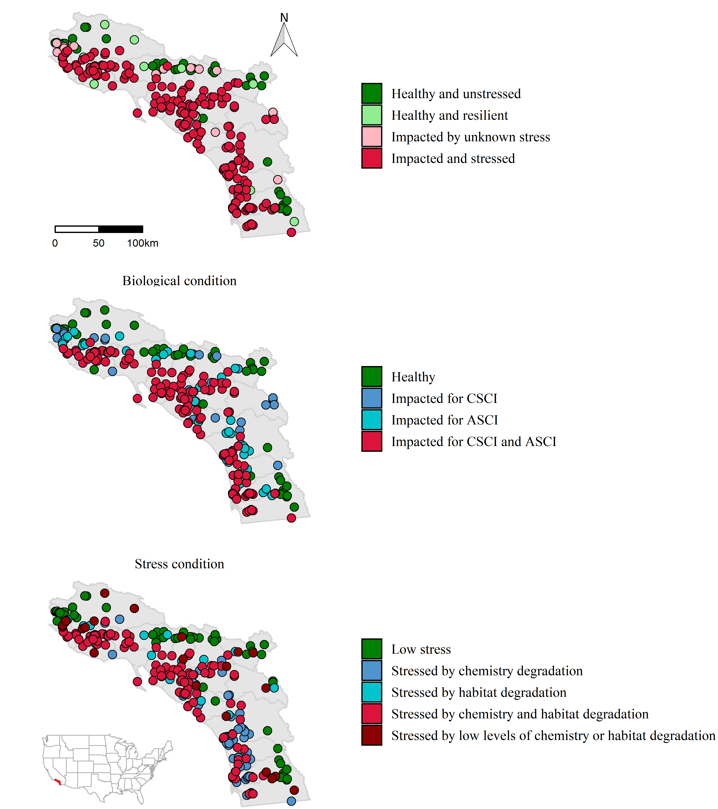

```{r setup, echo = F, warning = F, message = F, results = 'hide'}
# figure path, chunk options
knitr::opts_chunk$set(fig.path = 'figs/', warning = F, message = F, echo = F, cache = T, dev.args = list(family = 'serif'), dpi = 300, warning = F, out.width = '100%', cache.path = 'manu_draft_cache/',
  fig.process = function(x) {
  x2 = sub('-\\d+([.][a-z]+)$', '\\1', x)
  if (file.rename(x, x2)) x2 else x
  })

# libraries
library(Jabbrev)
# devtools::load_all('C:/proj/Jabbrev/.')
library(sf)
library(tidyverse)
library(gridExtra)
library(grid)
library(directlabels)
library(SQI)
library(jtools)
library(huxtable)
library(flextable)
library(officer)
library(patchwork)
library(ggalluvial)
source('R/funcs.R')

# data
data(sqidat)
data(sqidatinp)
data(sheds)
data(wqglm)
data(habglm)

# extract bib entries from online
bib_scrp('Beck_etal_SQI.Rmd', 'refs.bib', ext_bib = 'https://raw.githubusercontent.com/fawda123/refs/master/refs.bib')

# all colors used for categories
allcol <- getdsccol(palout = T)
```

```{r echo = F, cache = F, eval = F}
spelling::spell_check_files('Beck_etal_SQI.Rmd')
```

# Abstract

Monitoring and assessing stream health is a function of the physical, chemical, and biological integrity.  While monitoring all three indicators of stream integrity often occurs, combining all three indicators into a unified assessment of stream health rarely occurs, challenging non-technical environmental managers attempting to interpret complex environmental health information.  The goal of this study was to develop the Stream Quality Index (SQI), a single index that combines physical, chemical, and biological indicators into a scientifically rigorous, yet easy to understand tool for management decision making.  The SQI is based upon a stressor-response conceptual model.  Stress includes commonly measured chemical parameters indicative of anthropogenic inputs (conductivity, nitrogen, phosphorus) and two physical habitat indices that decribe both instream (i.e., substrate) and stream corridor (i.e., riparian) condition. Biological response includes benthic invertebrates and algae. Although the individual stressor and response components are quantitative and have similar meaning across a variety of environmental settings, the final outcome of the SQI is categorical with management connotations including: 1) healthy = unstressed and unimpacted biology, so protection is recommended; 2) resilient = stressed, but biological communities are healthy, so reducing stress is recommended; 3) impacted due to chemistry and/or physical habitat = stressed and impacted biology, so restoration is recommended, or; 4) impacted, causes unknown = unstressed, but biology is impacted, so causal assessment is recommended.  For clear transparency, an internet application was developed to allow quick dissection of the SQI from it’s categorical narrative for managers to the individual quantitative assessment of stressors or biological response metrics for scientists.

# Introduction

Monitoring and assessing stream health is a function of the physical, chemical, and biological integrity (33 USC §§ 1151, 1972).  Monitoring physical habitat integrity ensures all of the necessary environmental niches are present to support a diverse aquatic community [@Maddock99].  Monitoring chemical integrity ensures the absence of toxic compounds, but also the balanced minerals necessary to support aquatic life (ref).  Monitoring biological integrity, closest to the actual assessment of stream health, is necessary because unmeasured habitat or chemical water quality can impact otherwise balanced ecosystems [@Stoddard06;@Ode16]. 

A tremendous amount of effort is spent monitoring all three types of stream integrity indicators.  These monitoring programs can be large and complex or small and straightforward, but all share the same challenge; how to communicate the complex physical, chemical, and biological results in a scientifically rigorous, repeatable, yet readily understandable way to non-scientists [@NRC90].  Most environmental managers and decision makers are not scientists and don’t understand the intricate, nuanced details of ecological data.  An additional challenge is that ecological data are rarely black and white, so many of decisions asked of managers are made in the "grey zone" [@Paulsen08].  This is particularly true when the different lines of evidence are not in complete agreement.

Currently, there are many examples of how to effectively communicate single indicators.  Well known examples including biological assessment tools such as the Index of Biological Integrity [@Karr81], Observed to Expected ratios [@Hawkins00b], or hybrids of the IBI and O/E [@Mazor16].  Similarly, assessment tools also exist for chemical indicators such as the CCME Water Quality Index produced by the Canadian Council of Ministers of the Environment [@CCME01;@Hurley12].  Physical habitat assessment tools are less common, such as ____ (maybe CRAM?)

Creating an assessment tool that combines physical, chemical, and biological indicators into a single unified assessment are exceedingly rare [@Bay12]. Most frequently, the three indicators are individually simplified and presented in groups, leaving managers to decide which is most important [@Paulsen08]. If the goal is to communicate all three indicators of stream health to non-technical managers, then combining them into a single assessment score would be preferentially useful.  A single scale provides straightforward context for comparing one site to another to rank priorities for future efforts, or to track the improvement of single sites where management actions have already been implemented (or degradation where improvements are not implemented).  The challenge, as scientists, is creating a technically robust tool that is repeatable, where scores have similar meanings in different environmental settings, and provides clues as to what indicator is impacted and needs to be remediated.

The goal of this study was to develop the Stream Quality Index (SQI), a single index that combines physical, chemical, and biological indicators into a scientifically rigorous, yet easy to understand tool for management decision making.  The SCI is calibrated and validated specifically for southern California, USA, but the approach could be taken anywhere sufficient data is available.  Southern California makes for an excellent test case because of the extensive and varied levels of stress and biological impacts.  Moreover, there are a multitude of environmental managers with a wide variety of backgrounds and experience in technical and policy issues.

# Methods

## General Approach

The SQI is a conceptual approach to describing stream health that is based on a stressor-response relationship between biology and in-stream stressors (Figure \@ref(fig:sqiflo)).  Using these relationships, the index provides a categorical description of overall stream health to support high-level management decisions, while also providing descriptions of the biological, chemical, and physical components that establish the foundation of the index to further evaluate which factors may be driving stream health.  These tiers of information represent overall stream health, biological health, and stressor condition as single, actionable categories.  The underlying stressor-response relationships that define the categories are based on empirical models that quantify an expected likelihood of chemical or physical stressors impacting the separate components of biological condition.  Scientists and managers can easily access different components of the SQI depending on the desired level of information within the stressor-response paradigm. 

We selected water chemistry stressors that are strongly associated with biological condition in perennial streams, namely nutrients and conductivity.  Likewise, we selected physical habitat metrics that quantified flow, channel, and riparian condition observed at a site.  Although physical habitat can be considered a response metric of stream health depending on the context, physical habitat herein is considered a stressor that can affect biological condition at different taxonomic levels within the stressor-response model. 

## Biological response components of the SQI

### Characterizing biological condition

The stressor-response model used by the SQI uses biological endpoints as indicators of beneficial uses for wadeable streams and water chemistry and physical habitat measurements as stressors that are empirically linked to biological condition.  Because biological indicators provide direct measures of aquatic life, whereas physical and chemical measures provide ancillary information about the stressors that may affect aquatic life, it was crucial to combine these indicators in a way that preserved the types of information provided by each (as opposed to treating them as equivalent lines of evidence that could be "averaged"" to assess overall condition).

We used quantitative bioassessment indices as measures of biological condition.  Bioassessment indices for benthic macroinvertebrates and algal communities have been developed for California streams [@Mazor16;@Therouxip] and both indices are used as complementary lines of evidence within the SQI.  Analysis of multiple assemblages provides a more comprehensive indication of biological condition that can confirm overall stream health and may also provide additional diagnostic information about stressors (as different communities may respond to different characteristics of stream habitat).  

Biological responses were measured as two biological indices previously developed for California wadeable streams.  First, the California Stream Condition Index (CSCI, @Mazor16) is a predictive index that compares observed benthic macroinvertebrate taxa and metrics at a site to those expected under least disturbed reference conditions (sensu @Stoddard06). Expected values at a site are based on models that estimate the likely macroinvertebrate community relative to factors that naturally influence biology [@Moss87;@Cao07]. Second, the Algal Stream Condition Index (ASCI, @Therouxip) was similarly developed as a response endpoint for lower trophic levels; the ASCI is a non-predictive multi-metric index (i.e., it uses a uniform, statewide reference expectation) that incorporates both diatoms and soft-bodied algae. Scores for both indices can range from 0 to ~ 1.4, with a score of 1 at sites in reference condition and lower values indicating biological degradation.  Both indices are used as standard assessment measures for perennial wadeable streams in California. 

Index scores were compared to the distribution of scores at reference sites to assign BMI and algal samples to biological condition classes that described the likelihood of biological alteration.  For both the CSCI and ASCI, the 1st, 10th, and 30th percentiles of scores at reference sites were used to categorize sites as very likely to have altered biological condition (ref 4, scores less than the 1st percentile), likely altered (ref 3, scores between the 1st and 10th percentile), possibly altered (ref 2, scores between the 10th and 30th percentiles), and likely intact (ref 1, scores greater than the 30th percentile) (Table \@ref(tab:biocmb)).  This produced four classes for each index such that each site had two categories describing separate lines of evidence of the likelihood of biological alteration in the benthic macroinvertebrate and algal communities.  Both lines of evidence were jointly considered by the SQI for evaluating overall biological condition, described below.

### Integrating multiple measures of biological condition 

The assigned biological condition categories for each index were combined using a ranking system to create a single numeric value that represents an overall condition reflected by both biological indices. These values were assigned based on the judgment of stakeholders, in accordance with several principles. First, the two indices should be independently applicable, so that an indication of good health in one index cannot negate indications of poor health in the other. Second, the numeric values should be sensitive to differences between sites in marginal or extreme conditions. For example, the numeric value for a sample where both indices indicate likely intact biological communities will be higher than for a sample where one index indicates likely intact and the other indicates possibly altered. This sensitivity improves detection of small changes in condition. The final numeric values ranged from -4 to +4 (Table \@ref(tab:biocmb)). All negative values indicate impacted conditions.

## Stressor components

### Characterizing stress

Water chemistry and physical habitat measurements were used to describe stressors associated with low CSCI and ASCI scores [@Mazor15;@Therouxip] and have a conceptual relationship with both invertebrate and algal assemblages [@Richards97;@Pan02;@Wang07].  The water chemistry indicators included total nitrogen (mg/L), total phosphorus (mg/L) and specific conductivity ($\mu$S/cm).  Nitrogen, phosphorus, and conductivity are widely measured in many regional and statewide monitoring programs and collectively act as surrogates for unmeasured or alternative water quality problems at a site (e.g., temperature, light penetration).  Although other contaminants that can affect aquatic organisms are sometimes measured (e.g., metals, pesticides, pharmaceuticals), observations can be sparsely distributed in the study region [@Mazor15] and contaminants often co-occur with elevated nutrients or specific conductivity.  As such, the selected indicators may be an effective proxy for other unmeasured water quality stressors in southern California. 

Physical habitat conditions at a site were described using two indices of habitat condition developed for California: the Index of Physical-Habitat Integrity (IPI, @Rehn18) and the California Rapid Assessment Method for riverine wetlands [@Collins07;@Solek11]. The IPI is based on physical habitat metrics that characterize five components of in-stream habitat quality: physical habitat metrics (PHAB, [@Rehn18]) and scores from the California Rapid Assessment Method (CRAM).  The IPI is based on physical habitat metrics that characterize five components of in-stream habitat quality: percent sands, fines, or concrete (%SAFN), Shannon diversity of aquatic habitat types (H_AqHab), Shannon diversity of natural substrate types (H_SubNat), evenness of flow habitat types (Ev_FlowHab), and riparian vegetation cover (XCMG). All of the metrics are positively associated with physical habitat integrity such that an increase in each was generally considered an improvement in site condition. The exception is percent sands and fines where an increase is more commonly associated with degraded physical conditions (e.g., bank instability, watershed erosion). All physical data used to calculate these metrics were collected using standard field protocols described in @Ode07, which are derived from protocols used in national assessments [@USEPA16]. As with the CSCI, the IPI is a predictive index, and values for most metrics are compared to site-specific expectations appropriate for the stream's environmental setting. The IPI also ranges from 0 to ~1.4, with values less than 1 indicating departure from reference conditions.

In contrast to the IPI, CRAM is based on qualitative assessments of four attributes of riparian wetland function: landscape and buffer condition, hydrologic condition, physical structure, and biotic structure. Whereas the data for the IPI is derived from numerous quantitative measurements of physical habitat components collected along several transects, CRAM attributes are assessed on a whole-reach scale through visual observation. In general, CRAM characterizes larger-scale processes affecting stream condition both within and adjacent to the stream corridor, whereas the IPI focuses more narrowly on in-stream conditions. CRAM scores range from 25 to 100, with higher values indicating less degraded conditions at a site.

### Integrating multiple measures of stress

The combined impact of habitat or chemistry stressors on biological condition was evaluated by developing stress-response models that calculate the probability of observing poor biological conditions given observed levels of chemical or habitat stress. This approach eliminates the need to identify potential thresholds for identifying high levels of stress while also accounting for their combined impacts.

For both types of stress, a generalized linear model [@Fox11] was fit to calibration data to quantify associations for each separate water quality or physical habitat measure with binomial categories for altered or unaltered biology. Two models were developed:

\begin{equation}
pChem: p\left(bio\right) \sim \beta_{0} + \beta_{1}TN + \beta_{2}TP + \beta_{3}cond
(\#eq:pchem)
\end{equation}

\begin{equation}
pHab: p\left(bio\right) \sim \beta_{0} + \beta_{1}IPI + \beta_{2}CRAM
(\#eq:phab)
\end{equation}

where $p\left(bio\right)$ is the probability of biological alteration in equations \@ref(eq:pchem) and \@ref(eq:phab) given the indicators for each chemistry or physical habitat variable.  The probability of alteration is modelled using a logit link function for binomial variables, as $log\left(p / \left(1 - p\right)\right)$, where $p$ defines the presence or absence of altered biology described above.

An overall likelihood of biological alteration from both chemistry and physical habitat stressors was also estimated as a multiplicative function for $pChem$ and $pHab$:

\begin{equation}
pOverall: p\left(bio\right) \sim 1 - \left(\left(1 - pChem \right) \times \left(1 - pHab\right)\right)
(\#eq:poverall)
\end{equation}

The inverse of the likelihoods was used to represent an additive effect of both chemistry and physical habitat stressors.  Equations \@ref(eq:pchem), \@ref(eq:phab), and \@ref(eq:poverall) provided the empirical estimates of biological alteration that were used to define the categorical outputs of the SQI, defined below. 

## Combining stress and response measures into an overall Stream Quality Index (SQI)

The empirical framework for the binomial models and combined biological condition categories established a basis for the categorical descriptions from the SQI output.  These descriptions linked the quantitative data to management actions such that the results were easily interpreted with an indication of biological condition and the relevant stressors which may or may not be related to condition.  For the components in figure \@ref(fig:sqiflo), categorical outputs are provided by the index for the overall SQI, the biological condition, and the stress condition (figure \@ref(fig:sqicat)).  The categorical outputs were created from a matrix combination of the respective inputs.  For example, the overall SQI categories describe the four possible combinations of biology and stressors at a site from the binary categories of altered/unaltered biology and stressed/unstressed conditions: healthy and unstressed, health and resilient, impacted by unknown stress, and impacted and stressed.  

Separate categorical outputs were also created for the biological condition and stressor condition categories. The four possible outputs for the biological categories were based on the four combinations from the binary categories of high/low CSCI and high/low ASCI: healthy, impacted for CSCI, impacted for ASCI, and impacted for both.  The possible stressor condition categories for a site were based on the four outcomes of the binary combinations of high/low chemistry stress and high/low physical habitat stress: low stress, stressed by chemistry, stressed by habitat, and stressed by both. A fifth stress category was also possible based on the additive combinations of low chemistry and low habitat stress if $pOverall$ exceeded the threshold even though $pChem$ and $pHab$ did not. Thresholds for biological indices that defined high/low condition were based on the tenth percentile distribution of scores at reference sites for each index.  Thresholds for high/low stress were based on the median likelihood across all sites.

## Application

All data for the SQI were from the Stormwater Monitoring Coalition (SMC) regional monitoring program in southern California [@Mazor15].  This coalition represents multiple state, federal, and local agencies that have a shared mission of stormwater management for over 7000 stream kilometers in the region.  The SMC initiated a regional monitoring program in 2009 to assist, in part, with the permitting process among dischargers from the member agencies.  Central monitoring questions focus on assessing biological condition, identifying stressors associated with poor condition, and evaluating trends over time.  This dataset represents the most comprehensive source of stream data in Southern California.  Because the SQI requires synoptic biological, chemistry, and physical habitat data, the final dataset used for model calibration represents a subset of the SMC dataset where all three components were simultaneously collected. This included 266 sites, 75\% of which were used for model calibration.  Sampling dates ranged from 2009 to 2016 with relatively even distribution of samples between years.  Most sample events occurred between May and June following standard protocols for perennial stream surveys [@Ode07].

Finally, precision and sensitivity of the SQI was evaluated to describe 1) how well the underlying empirical model described the likelihood of biological alteration, and 2) sensitivity of the model output to changing thresholds that defined the categorical conditions.  The first analysis evaluated precision in the validation dataset for the SQI to determine agreement between the model and actual stress and biological conditions.  The second analysis evaluated the change in results for the regional database that were caused by changing the definitions of healthy or impacted biology that were described by the stress response models.  For example, the percentage of sites categorized as stressed or unstressed was compared by changing the cutoff point for healthy/impacted biology in Table \@ref(tab:biocmb).

# Results

## SQI patterns

Among all sites, the overall SQI categorized a majority as having altered biology under high stress conditions (impacted and stressed, 64\% of sites, Table \@ref(tab:sqicnt)).  Just over 20\% of sites were in the opposite category of unaltered biology in low stress conditions (healthy and unstressed).  For the remaining two categories of the overall SQI, only 2\% had unaltered biology but were under high stress conditions (healthy and resilient), whereas 13\% sites had altered biology not related to physical or chemical stressors (impacted by unknown stress).  For the biological condition category, sites with altered conditions were more often altered for both CSCI and ASCI scores (50\%).  For sites with one low scoring index, more sites were altered for the ASCI (16\%) than the CSCI (11\%).  Less than a quarter of all sites had unaltered biology (23\%).  For stress conditions, 35\% of sites were stressed by both chemistry and physical habitat stressors.  More sites were stressed by water chemistry (12\%) than physical habitat degradation (7\%) if only one stressor was present.  Over 45\% of sites had low stress and no sites were stressed by the additive effect of both low chemistry and physical habitat stressors.    

Spatial patterns among SQI categories in Southern California generally followed elevation and land use gradients (Figure \@ref(fig:sqimap)).  More altered biological communities and high stress conditions were observed toward coastal areas in the lower watersheds and where urbanization is highest (e.g., Los Angeles, Orange County, Ventura, San Diego).  Sites with altered biological condition showed similar spatial patterns as the overall SQI, although sites altered only for the ASCI were more often observed at mid-elevation across the study region whereas sites altered only for the CSCI were more common at higher elevation areas in central and northern ares of the study region. Stress condition patterns were similar to biology although low stress conditions also occured closer to coastal areas in addition to higher elevation areas in each watershed.  This produced a handful of sites that had altered biology but under low stress conditions at mid-elevation ranges (i.e., impacted by unknown stress, Table \@ref(tab:sqicnt)).    

```{r eval = T, echo = F}
pchemn <- sum(sqidat$pChem > 0.5) 
pchemp <- round(100 * sum(sqidat$pChem > 0.5) / nrow(sqidat), 0)

phabn <- sum(sqidat$pHab > 0.5) 
phabp <- round(100 * sum(sqidat$pHab > 0.5) / nrow(sqidat), 0)

poveralln <- sum(sqidat$pChemHab > 0.5) 
poverallp <- round(100 * sum(sqidat$pChemHab > 0.5) / nrow(sqidat), 0)
```

## Model precision

```{r}
pchemchk <- lm(pChem ~ bio_fp * SiteSet, data = sqidat)
phabchk <- lm(pHab ~ bio_fp * SiteSet, data = sqidat)
poverallchk <- lm(pChemHab ~ bio_fp * SiteSet, data = sqidat)
```


The distinction between healthy and impacted biological communities was well described by the estimated likelihood of biological alteration provided by the empirical models (Figure \@ref(fig:boxlik)).  Slightly larger differences between the likelihood of alteration for healthy and impacted communities was observed for the chemistry model compared to the physical habitat model, suggesting an improved fit for the former.  For the overall likelihood of biological alteration (*pOverall*), more sites were greater than 90\% likely to altered in the impacted category as compared to the separate *pChem* and *pHab* models. For all cases, (*pChem*, *pHab*, *pOverall*), there were no systematic differences in model results between calibration and validation datasets ($p >$ 0.05 for the interaction and fixed effect of site type in linear models describing likelihood of alteration between impact categories and site type). 

The underlying empirical models provided insight into instream characteristics that were related to the likelihood of biological alteration (Figures \@ref(fig:strlik), \@ref(fig:rspcrv)).  About `r pchemp`\% of sites (n = `r pchemn`) had greater than 50\% likelihood of biological alteration from water chemistry stressors and `r phabp`\% (n = `r phabn`) had greater than 50\% likelihood of biological alteration from physical habitat stressors (Figure \@ref(fig:strlik)).  Collectively, `r poverallp`% (n = `r poveralln`) of sites had greater than 50\% likelihood of biological alteration from the overall stress of both chemistry and physical habitat stressors. 

```{r}
calset <- sqidat %>% 
  filter(SiteSet %in% 'Cal')
crhab <- cor.test(calset$IPI, calset$indexscore_cram) %>% 
  .$estimate %>% 
  round(2)

habglmsub1 <- glm(bio_fp ~ indexscore_cram,
              family = binomial('logit'), data = calset)
habglmsub2 <- glm(bio_fp ~ IPI,
              family = binomial('logit'), data = calset)
```

Water chemistry and physical habitat predictors included in the empirical response models for *pChem* and *pHab* (equations \@ref(eq:pchem), \@ref(eq:phab)) explained a substantial portion of variability among sites related to the occurrence of biological alteration (Table \@ref(tab:strmod)). The *pChem* explained 64\% of the variation among sites, whereas the *pHab* model explained 42\%.  All predictors in the *pChem* were significantly and positively associated ($p < 0.05$) with the occurrence of biological alteration.  Only the CRAM predictor in the *pHab* model was significantly associated th occurrence of biological alteration.  Both CRAM and IPI are significantly correlated in the calibration dataset ($r =$ `crhab`), which masked the effect of IPI on biological alteration in the *pHab* model. However, exclusion of CRAM from the *pHab* model reduced the explanatory power by approximately 14\% and both were retained for the SQI.

Figure \@ref(fig:rspcrv) demonstrates how the individual components for each stressor model were related to likelihood of alteration.  These partial dependency plots were created by estimating the likelihood of alteration across a range of values for each predictor while holding other predictors constant.  For each plot, the variables in each model (equations \@ref(eq:pchem), \@ref(eq:phab)) not on the x-axis were held at approximate values that were associated with low stress to better understand how biological alteration may be related to each predictor.  For water chemistry stressors, all were positively associated with likelihood of alteration, particularly conductiviity which had the steepest per unit increase in likelihood.  Associations of biological alteration with physical habitat predictors were as expected, except that decreasesin likelihood of biological alteration were observed with increasein IPI and CRAM given that both are indicators of habitat condition.  The strongest relationship was observed with increases in CRAM scores, where likelihood of alteration decreased sharply with CRAM scores greater than 50.  Increases in IPI scores were also associated with decreases in likelihood of alteration except the relationship had more uncertainty than for CRAM scores. 

*	SQI performance metrics
     * 	Precision
     * 	Any others?
*	Percent So Cal stream miles or site frequency in each category
     * 	As a set up for the value of the categorical scoring
*	Overall agreement among stressor indicators
     * 	As a set up for do we need multiple indicators?
*	Overall agreement among response indicators
     * 	As a set up for do we need multiple indicators?
*	SQI trends either overall or at example sites

# Discussion

The Stream Quality Index fills a common need of watershed managers to synthesize large amounts of information when making decisions or communicating the technical basis for those decisions. This need is particularly important in regions like Southern California, where large-scale landscape alteration and competing demands for water usage creates a need for prioritization of limited resources. We have demonstrated how this index may be used to prioritize sites for restoration, protection, and other management activities on a large scale, allowing managers to recognize large-scale patterns that may not be evident if analyses were conducted on a site-by-site basis.

Because our index was focused on assessing environmental health, a key challenge was reflecting relationships among indicators of stream quality consistent with our conceptual model of a healthy stream ecosystem. That is, it was crucial to combine biological, chemical, and habitat indicators in a way that properly reflects the role of biology as a direct measure of condition, and the role of other indicators as measures of stress. Importantly, a finding of good water chemistry should not obscure or distort an indication of poor biology, and vice versa. We determined that a categorical approach was an appropriate way to address this concern, as a simple quantitative index that treats each indicator as independent lines of evidence could not effectively characterize situations where these indicators disagreed — a common situation in our data set. [Something about SQOs here?]

As a categorical index, the SQI provides a readily interpretable description of stream conditions. The four classes defined by the index (i.e., healthy and unstressed, healthy and resilient, impacted and stressed, impacted by unknown stress) can be understood by a general audience with little familiarity with the underlying data or the tools used to analyze them. In contrast, numeric indices demand a higher level of experience to interpret; without training, an unfamiliar audience cannot easily identify which values of a numeric index correspond to conditions requiring protection and which correspond to problems requiring intervention. [Although categorical indices create challenges for assessing trends or identifying borderline conditions, we have addressed this by XYZ .]

The SQI addresses the challenge of synthesizing large amounts of information about stream condition while preserving the components and presenting them for more detailed exploration. The index is structured in layers, allowing interested users to explore reasons for categorical classificaton of each site. That is, users can determine which biological indicators account for a stream's health rating, along with which stressors may or not be associated with biological condition.  Users can identify presence or absence of physical and/or chemical stressors and which components in equations \@ref(eq:pchem) and \@ref(eq:phab) may be linked to their respective stressor categories.  Further, physical habitat measures described by CRAM and IPI include additional metrics that were used to calculate scores at each site. Although these metrics were not explicit components in the empirical models of the SQI, they serve as additional diagnostic information to describe physical conditions at each site. 

Our approach to characterizing stressors differs from similar efforts, making the SQI well suited for use with ambient monitoring programs.  The Canadian Water Quality Index (CWQI, @CCME01, @Hurley12) is a similar tool that evaluates the scope, frequency, and amplitude  of water quality objective exceedances for numerous parameters, resulting in a numeric value that ranges from 0 (poor) to 100 (excellent). This approach is appropriate for assessing compliance  with regulatory criteria at sites where monitoring covers many parameters and occurs at regular intervals (i.e., at selected sites of interest, such as below discharge points or at mass-emission stations). In contrast, the SQI is better suited for ambient monitoring programs (e.g., the SMC, @Mazor15, or the National Rivers and Streams Assessment, @USEPA16) that typically sample many sites with little or no replication and focusing on just a few indicators broadly indicative of water chemistry conditions rather than a large suite of potential stressors. Our approach is also applicable to indicators where thresholds are unavailable (e.g., CRAM or IPI), yet the relevance for measuring aquatic life supportis maintained even if it has less bearing on regulatory compliance than other approaches, such as the CWQI. Finally, our approach can be directly interpreted without familiarity of established benchmarks because the empirical stress models inthe SQI are expressed as probabilities of degrading biological condition, rather than abstract numbers.

Our theoretical framework for the SQI is not without drawbacks. The index currently cannot accommodate additional or fewer indicators of stress or stream condition.  This differs from the CWQI that can include any number of available parameters. Missing data (e.g., lost samples or incomplte coverage of required data at a site) prevents calculation of the SQI and the index cannot be estimated without recalibration to include or exclude individual components.  The initial SQI described herein was purposefully restricted to a limited number of parameters to focus on developing the foundation of the index, knowing that a broader scope could preclude many sites from analysis.  For example, CSCI and ASCI scores for the biological components of the SQI are available at over 1000 sites in southern California.  Combining these data with the required chemical and physical stressor data reduced the total dataset where all components were available to only `r nrow(sqidat)` sites.  Additional work on the SQI should explore how the categorical descriptions can be provided in the absence of all the necessary components.  For example, missing IPI data could be replaced with a mean value appropriate for the region so as not to bias the outcome, whereas the effect of this estimation should be explicitly demonstrated as a component of uncertainty in the final SQI output. Similarly, a mechanism for adding additional components to the SQI that are not currently included should be explored.

## The SQI web application 

A web application was developed to make the SQI accessible to managers and other stakeholders (<https://sccwrp.shinyapps.io/sqi_shiny>). First, the web interface uses an open source software program developed in R [@Chang18;@RDCT18] to automate batch calculation of the SQI at large numbers of sites [@Beck18f].  This allows the index and web application to be easily updated as new data become avialable. Second, visualizations also support exploration of the data at both regional and site scales, improving flexibility of application by allowing users to explore results in different spatial contexts. Scores for each index component are provided, with the option to view the underlying data that were used for the empirical stress models and categorical outcomes. A map allows comparison of sites of interest to the region as a whole, as well as county- or watershed-level summaries. 

As an example, a selected site in eastern San Diego county is shown to have healthy biological conditions (i.e., unimpacted benthic macroninvertebrate and algal communities), whereas stress data suggest presence of physical or chemical habitat degradtation (i.e., overall SQI category is healthy and resilient). If additional details are needed, exploration of components of the web application allow the user to identify the presence of different stressors.  For the selected site, only physical stress was observed and unusually high levels of sands and fines as one component of the overall physical stress measure was observed, relative to the other stress measures that were comparable to ranges observed for the region.  With this information, managers can prioritize follow-up actions to identify causes of elevated sands and fines, e.g., wildfire, bank erosion, or other sources, and any additional management actions that can result from this information, e.g., formal causal analysis or site restoration. As such,the web application provides a screening tool to rapidly assess condition and identify potential stresors that may be impacting condition. Without this interactive tool, priorities are more difficult to identify as managers and stakeholders must rely on less intuitive research products (e.g., tabular data).

## Conclusions 

An integrated stream quality index has the potential to transform watershed management by giving managers a tool to synthesize large amounts of data, assign priorities based on this synthesis, and communicate these decisions to a broad range of stakeholders who may lack familiarity with bioassessment or watershed science. The index preserves our understanding of the roles of different indicators in describing stream health, combining them into a single, easily understood category, while also preserving the information contributing to the integrated assessment. An integrated stream quality index could be used to communicate information in both technical and non-technical venues, such as watershed assessments, permit reporting requirements, and routine environmental report cards.

# Figures

```{r sqiflo, fig.cap = "Flowchart representation of the Stream Quality Index (SQI).  The overall SQI is a function of the likelihood of observing degraded biological condition given the stressors at a site.  Biological condition is assessed using macroinvertebrate (California Stream Condition Index, CSCI) and algal (Algal Stream Condition Index, ASCI) indices and stressors are evaluated based on water quality measures (total nitrogen, total phosphorus, conductivity) and physical habitat (California Rapid Assessment Method or CRAM, physical habitat metrics or PHAB). Stress condition is empirically linked to bilogical condition by separate probability functions for chemistry (pCHem) and physical habitat (pHab)."}

```

```{r sqicat, fig.cap = "Categorical site descriptions that are possible from the Stream Quality Index (SQI).  The overall SQI is described as the possible outcomes from biological and stress conditions.  The biological conditions are described by the possible outcomes from the CSCI and ASCI.  The stress conditions are described by the possible outcomes from the chemistry and habitat stressors.  A fifth stress category is possible because stress from both chemistry and habitat was multiplicative."}

```

```{r, results = 'hide'}
toplo <- sqidat %>% 
  dplyr::select(MasterID, StreamHealthIndex, BiologicalCondition, OverallStressCondition_detail) %>% 
  gather('var', 'val', -MasterID, -geometry) %>% 
  mutate(
    var = factor(var, 
                 levels = c('StreamHealthIndex', 'BiologicalCondition', 'OverallStressCondition_detail'),
                 labels = c('Overall SQI', 'Biological condition', 'Stress condition'))
  )

toplo1 <- toplo %>% 
  filter(var %in% 'Overall SQI') %>% 
  mutate(
    val = factor(val, 
                 levels = c("Healthy and unstressed", "Healthy and resilient", "Impacted by unknown stress", "Impacted and stressed")
                 )
  )
toplo2 <- toplo %>% 
  filter(var %in% 'Biological condition') %>% 
  mutate(
    val = factor(val, 
                 levels = c("Healthy", "Impacted for CSCI", "Impacted for ASCI", "Impacted for CSCI and ASCI")
                 )
  )
toplo3 <- toplo %>% 
  filter(var %in% 'Stress condition') %>% 
  mutate(
    val = factor(val, 
                 levels = c("Low stress", "Stressed by chemistry degradation", "Stressed by habitat degradation", "Stressed by chemistry and habitat degradation", "Stressed by low levels of chemistry or habitat degradation")
                 )
  )

sqicol <- getdsccol(palfac = 'StreamHealthIndex')
biocol <- getdsccol(palfac = 'BiologicalCondition')
strcol <- getdsccol(palfac = 'OverallStressCondition_detail')

legpos <- 'right'
sz <- 3
p1 <- ggplot() + 
  geom_sf(data = sheds, colour = 'lightgrey') + 
  geom_sf(data = toplo1, aes(fill = val), pch = 21, colour = 'black', size = sz) + 
  facet_wrap(~var) + 
  # scale_colour_manual(values = sqicol$col) + 
  scale_fill_manual(values = sqicol$col) +
  theme_void(base_family = 'serif', base_size = 14) + 
  theme(
    legend.position = legpos,
    legend.title = element_blank(),
    legend.justification = "left"
  ) +
  guides(fill = guide_legend(override.aes = list(size = 0.5)))
p1leg <- g_legend(p1)
p1 <- p1 +
  theme(
    legend.position = 'none',
    panel.grid = element_line(colour = NA),
    strip.background = element_blank(),
    legend.title = element_blank()
    )
p2 <- ggplot() + 
  geom_sf(data = sheds, colour = 'lightgrey') + 
  geom_sf(data = toplo2, aes(fill = val), pch = 21, colour = 'black', size = sz) + 
  facet_wrap(~var) + 
  scale_fill_manual(values = biocol$col) +
  theme_void(base_family = 'serif', base_size = 14) + 
  theme(
    legend.position = legpos,
    legend.title = element_blank(),
    legend.justification = "left"
  ) +
  guides(fill = guide_legend(override.aes = list(size = 0.5)))
p2leg <- g_legend(p2)
p2 <- p2 +
  theme(
    legend.position = 'none',
    panel.grid = element_line(colour = NA),
    strip.background = element_blank(),
    legend.title = element_blank()
    )

p3 <- ggplot() + 
  geom_sf(data = sheds, colour = 'lightgrey') + 
  geom_sf(data = toplo3, aes(fill = val), pch = 21, colour = 'black', size = sz) + 
  facet_wrap(~var) + 
  scale_fill_manual(values = strcol$col) +
  theme_void(base_family = 'serif', base_size = 14) + 
  theme(
    legend.position = legpos, 
    legend.title = element_blank(),
    legend.justification = "left"
  ) +
  guides(fill = guide_legend(override.aes = list(size = 0.5)))
p3leg <- g_legend(p3)
p3 <- p3 +
  theme(
    legend.position = 'none',
    panel.grid = element_line(colour = NA),
    strip.background = element_blank(),
    legend.title = element_blank()
    )

maxWidth = grid::unit.pmax(p1leg$widths[2:5], p2leg$widths[2:5], p3leg$widths[2:5])
 p1leg$widths[2:5] <- as.list(maxWidth)
 p2leg$widths[2:5] <- as.list(maxWidth)
 p3leg$widths[2:5] <- as.list(maxWidth)

png('figs/sqi_map.png', height = 8, width = 8, units = 'in', res = 500)
grid.arrange(
  arrangeGrob(p1, p2, p3, ncol=1),
  arrangeGrob(p1leg, p2leg, p3leg, ncol=1),
  ncol = 2)
dev.off()
```
```{r sqimap, fig.cap = "Categorical site descriptions for the Stream Quality Index (SQI) at monitoring sites in Southern California.  The overall SQI (top) is described as the possible outcomes from biological (middle) and stress conditions (bottom).  The biological conditions are described by the possible outcomes from the CSCI and ASCI.  The stress conditions are described by the possible outcomes from the chemistry and habitat stressors."}

```


```{r, results = 'hide'}
sqicol <- getdsccol(palfac = 'StreamHealthIndex')

toplo <- sqidat %>% 
  st_set_geometry(NULL) %>% 
  dplyr::select(pChem, pHab, pChemHab, bio_fp, SiteSet, StreamHealthIndex) %>% 
  gather('var', 'val', -bio_fp, -SiteSet, -StreamHealthIndex) %>% 
  mutate(
    bio_fp = factor(bio_fp, levels = c(0, 1), labels = c('healthy', 'impacted')), 
    var = factor(var, levels = c('pChem', 'pHab', 'pChemHab'), labels = c('pChem', 'pHab', 'pOverall'))
  )

p <- ggplot(toplo, aes(x = bio_fp, y = val, fill = SiteSet)) + 
  geom_point(aes(group = SiteSet, colour = StreamHealthIndex), position = position_jitterdodge(jitter.width = 0.25)) + 
  geom_boxplot(alpha = 0.5, outlier.alpha = 0) + 
  facet_wrap(~var, ncol = 3) + 
  theme_bw(base_family = 'serif', base_size = 12) + 
  theme(
    # axis.title.x = element_blank(), 
    legend.title = element_blank(), 
    # legend.position = 'top', 
    strip.background = element_blank()
  ) + 
  scale_colour_manual(values = sqicol$col) + 
  scale_fill_manual(values = c('lightblue', 'skyblue4')) +
  ylab('p(Bio): Likelihood of biological alteration') +
  xlab('Observed biological state (CSCI, ASCI)') #+
  # guides(colour = guide_legend(override.aes = list(shape = NA)))


png('figs/box_lik.png', height = 4, width = 8, family = 'serif', res = 400, units = 'in')
p
dev.off()
```
```{r boxlik, fig.cap = "Boxplot distributions of the modelled likelihood of biological alteration relative to water chemistry (*pChem*, eqn. \\\\@ref(eq:pchem)) and physical habitat variables (*pHab*, eqn. \\\\@ref(eq:phab)) and the additive overall stress as the product between the two (*pOverall*, eqn. \\\\@ref(eq:poverall)). Groups are separated into healthy or impacted biological condition at each site (Table \\\\@ref(tab:biocmb)) as the response measure for each model and by calibration/validation datasets (3:1 split).  Points show the four possible categorical outcomes from the overall SQI. CSCI: California Stream Condition Index, ASCI: Algal Stream Condition Index"}
knitr::include_graphics('figs/box_lik.png')
```

```{r, results = 'hide'}

strcol <- getdsccol(palfac = 'OverallStressCondition_detail')

toplo <- sqidat %>% 
  st_set_geometry(NULL) %>% 
  select(pChem, pHab, pChemHab, OverallStressCondition_detail) %>% 
  mutate(OverallStressCondition_detail = factor(OverallStressCondition_detail,
                                                levels = c("Low stress", "Stressed by chemistry degradation", "Stressed by habitat degradation", "Stressed by chemistry and habitat degradation", "Stressed by low levels of chemistry or habitat degradation"),
                                                labels = c("Low stress", "Stressed by chemistry", "Stressed by habitat", "Stressed by chemistry and habitat", "Stressed by low levels of both"
)))

xgrid <- seq(min(toplo$pHab, na.rm = T), max(toplo$pHab, na.rm = T), length = 100)
ygrid <- seq(min(toplo$pChem, na.rm = T), max(toplo$pChem, na.rm = T), length = 100)

data.fit <- expand.grid(pHab = xgrid, pChem = ygrid)

data.loess <- loess(pChemHab ~ pHab * pChem, data = toplo)
mtrxd <- predict(data.loess, newdata = data.fit) %>% 
  reshape2::melt() %>% 
  mutate(
    pHab = as.numeric(gsub('^pHab=', '', pHab)), 
    pChem = as.numeric(gsub('^pChem=', '', pChem))
  ) %>% 
  rename(pChemHab = value)

cols <- getdsccol(palfac = 'OverallStressCondition')$col

p1 <- ggplot(mtrxd, aes(x = pChem, y = pHab, z = pChemHab)) + 
  stat_contour(aes(colour = ..level..), breaks = c(seq(0.2, 0.9, by = 0.1))) + 
  geom_point(data = toplo, aes(x = pChem, y = pHab, fill = pChemHab), pch = 21, colour = 'lightgrey', size = 4) +
  theme_bw(base_family= 'serif') + 
  theme(
    legend.position = 'top',
    legend.title = element_text(face = 'italic'), 
    axis.title = element_text(face = 'italic')
  ) + 
  scale_colour_gradientn('pOverall', colours = cols, guide = F)+
  scale_fill_gradientn('pOverall', colours = cols) +
  guides(fill = guide_colourbar(barheight = 0.5, barwidth = 9, title.position = 'top', title.hjust = 0.5))
pleg1 <- g_legend(p1)
p1 <- p1 + theme(legend.position = 'none')
# p1 <- direct.label(p1, list('bottom.pieces', cex = 0.7))

p2 <- ggplot(mtrxd, aes(x = pChem, y = pHab, z = pChemHab)) + 
  stat_contour(breaks = c(0.979), colour = 'black', linetype = 'dashed') + 
  geom_point(data = toplo, aes(x = pChem, y = pHab, fill = OverallStressCondition_detail), pch = 21, colour = 'lightgrey', size = 4) +
  theme_bw(base_family= 'serif') + 
  geom_vline(xintercept = 0.87, linetype = 'dashed') + 
  geom_hline(yintercept = 0.72, linetype = 'dashed') +
  theme(
    legend.position = 'top',
    legend.title = element_text(face = 'italic'), 
    axis.title = element_text(face = 'italic')
  ) + 
  scale_colour_gradientn('pOverall', colours = cols, guide = F) +
  scale_fill_manual('Stress condition', values = strcol$col) + 
  guides(fill = guide_legend(title.position = 'top', title.hjust = 0.5, ncol = 2))
pleg2 <- g_legend(p2)
p2 <- p2 + theme(legend.position = 'none')

png('figs/str_lik.png', height = 4.5, width = 8, family = 'serif', res = 400, units = 'in')

(wrap_elements(pleg1) + p1 + plot_layout(ncol = 1, heights = c(0.05, 1))) - 
  (wrap_elements(pleg2) + p2 + plot_layout(ncol = 1, heights = c(0.05, 1))) + plot_layout(ncol = 2, heights = c(0.2, 1))

dev.off()
```
```{r strlik, fig.cap = "Relationship between stress models for water chemistry (*pChem*, eqn. \\\\@ref(eq:pchem)) and physical habitat (*pHab*, eqn. \\\\@ref(eq:phab)).  Stress models for water chemistry and physical habitat were created based on the likelihood of biological alteration for the observed stress measures.  The overall stress meaures (*pOverall*, eqn. \\\\@ref(eq:poverall)) is the product of both stress models shown in the left plot.  Points represent estimated stress at a single site.  The right plot shows the same points but colored by the stress condition categories that are defined by thresholds from the dotted lines."}
knitr::include_graphics('figs/str_lik.png')
```


```{r, results = 'hide'}
opt_vrs <- list(
 TN = 0,
 TP = 0.1,
 Cond = 100
 )  

# wq
toplotn <- strs_surf('TN', mod  = 'wq_mod', mod_in = 'wqglm', opt_vrs = opt_vrs)
toplotp <- strs_surf('TP', mod  = 'wq_mod', mod_in = 'wqglm', opt_vrs = opt_vrs)
toplocn <- strs_surf('Cond', mod  = 'wq_mod', mod_in = 'wqglm', opt_vrs = opt_vrs)

biocol <- getdsccol(palfac = 'BiologicalCondition')

# plots
p1 <- ggplot(toplotn, aes(x = TN)) +
  geom_ribbon(aes(ymin = fit - fitse, ymax = fit + fitse), fill = 'lightblue', colour = NA, alpha = 0.6) +
  geom_rug(data = sqidat, aes(x = TN, colour = BiologicalCondition), sides = 'b') +
  geom_line(aes(y = fit)) +
  geom_line(aes(y = fit + fitse), linetype = 'dashed') + 
  geom_line(aes(y = fit - fitse), linetype = 'dashed') + 
  theme_bw(base_size = 12,base_family = 'serif') +
  scale_colour_manual(values = biocol$col) +
  xlab('Total Nitrogen (mg/L)') + 
  xlim(range(toplotn$TN)) +
  theme(
    axis.title.y = element_blank(),
    legend.position = 'none'
    )
    
p2 <- ggplot(toplotp, aes(x = TP)) +
  geom_ribbon(aes(ymin = fit - fitse, ymax = fit + fitse), fill = 'lightblue', colour = NA, alpha = 0.6) +
  geom_rug(data = sqidat, aes(x = TP, colour = BiologicalCondition), sides = 'b') +
  geom_line(aes(y = fit)) +
  geom_line(aes(y = fit + fitse), linetype = 'dashed') + 
  geom_line(aes(y = fit - fitse), linetype = 'dashed') + 
  theme_bw(base_size = 12,base_family = 'serif') +
  scale_colour_manual(values = biocol$col) +
  xlab('Total phosphorus (mg/L)') + 
  xlim(range(toplotp$TP)) +
  theme(
    axis.title.y = element_blank(), 
    legend.position = 'none'
    )
    
p3 <- ggplot(toplocn, aes(x = Cond)) +
  geom_ribbon(aes(ymin = fit - fitse, ymax = fit + fitse), fill = 'lightblue', colour = NA, alpha = 0.6) +
  geom_rug(data = sqidat, aes(x = Cond, colour = BiologicalCondition), sides = 'b') +
  geom_line(aes(y = fit)) +
  geom_line(aes(y = fit + fitse), linetype = 'dashed') + 
  geom_line(aes(y = fit - fitse), linetype = 'dashed') + 
  theme_bw(base_size = 12,base_family = 'serif') +
  scale_colour_manual(values = biocol$col) +
  xlab('Conductivity (uS/cm)') + 
  xlim(range(toplocn$Cond)) +
  theme(
    axis.title.y = element_blank(),
    legend.position = 'none'
    )
  
opt_vrs <- list(
    indexscore_cram = 100,
    IPI = 1
  )

# hab
toplocrm <- strs_surf('indexscore_cram', mod  = 'hab_mod', mod_in = 'habglm', opt_vrs = opt_vrs)
toploipi <- strs_surf('IPI', mod  = 'hab_mod', mod_in = 'habglm', opt_vrs = opt_vrs)

# plots
p4 <- ggplot(toplocrm, aes(x = indexscore_cram)) +
  geom_ribbon(aes(ymin = fit - fitse, ymax = fit + fitse), fill = 'lightblue', colour = NA, alpha = 0.6) +
  geom_rug(data = sqidat, aes(x = indexscore_cram, colour = BiologicalCondition), sides = 'b') +
  geom_line(aes(y = fit)) +
  geom_line(aes(y = fit + fitse), linetype = 'dashed') + 
  geom_line(aes(y = fit - fitse), linetype = 'dashed') + 
  theme_bw(base_size = 12,base_family = 'serif') +
  scale_colour_manual(values = biocol$col) +
  xlab('CRAM') + 
  xlim(range(toplocrm$indexscore_cram)) +
  theme(
    axis.title.y = element_blank(),
    legend.position = 'none'
    )
    
p5 <- ggplot(toploipi, aes(x = IPI)) +
  geom_ribbon(aes(ymin = fit - fitse, ymax = fit + fitse), fill = 'lightblue', colour = NA, alpha = 0.6) +
  geom_rug(data = sqidat, aes(x = IPI, colour = BiologicalCondition), sides = 'b', size = 1) +
  geom_line(aes(y = fit)) +
  geom_line(aes(y = fit + fitse), linetype = 'dashed') + 
  geom_line(aes(y = fit - fitse), linetype = 'dashed') + 
  theme_bw(base_size = 12,base_family = 'serif') +
  scale_colour_manual('Biological condition', values = biocol$col) +
  xlab('IPI') + 
  xlim(range(toploipi$IPI)) +
  theme(
    axis.title.y = element_blank(),
    legend.position = 'top'
    ) + 
  guides(colour = guide_legend(title.position = 'top', title.hjust = 0.5))

pleg <- g_legend(p5)
p5 <- p5 + theme(legend.position = 'none')

png('figs/rsp_crv.png', height = 6.5, width = 8, res = 500, units = 'in', family = 'serif')
grid.arrange(
  left = textGrob('Likelihood of alteration', rot = 90), 
  arrangeGrob(
    pleg,
    textGrob('Water chemistry'), 
    arrangeGrob(p1, p2, p3, ncol = 3),
    textGrob('Physical habitat'), 
    arrangeGrob(p4, p5, ncol = 2), 
    ncol = 1, heights = c(0.2, 0.1, 1, 0.1, 1)
  )
)
dev.off()
```
```{r rspcrv, fig.cap = "Modelled likelihood of biological alteration from water quality (top) and physical habitat stressors (bottom). Curves are the binomial likelihood (+/- standard error) of biological condition being altered (as measured by macroinvertebrate and algal indices) across the range of observed values for water quality and physical habitat stressors on the x-axes.  The water chemistry and physical habitat stress plots are derived from equations \\\\@ref(eq:pchem) and \\\\@ref(eq:phab).  Other variables in each model not on the x-axis for each plot are held constant at values for low stress conditions.  Biological condition for observations in each stressor model are shown as rug plots on the x-axes."}
knitr::include_graphics('figs/rsp_crv.png')
```

```{r results = 'hide', eval = F}
# toshw <- c('OverallStressCondition_detail', 'StreamHealthIndex')
# 
# strssens <- crossing(qnt = seq(0.1, 0.9, by = 0.1), thrshfun = c('chmthrsh', 'habthrsh', 'allthrsh')) %>% 
#   group_by(qnt, thrshfun) %>% 
#   nest %>% 
#   mutate(
#     est = purrr::pmap(list(qnt, thrshfun), function(qnt, thrshfun){
#     
#       toeval <- paste0('sqibiosens(sqidatinp, thrsh = 0, ',  thrshfun, ' = ', qnt, ', thrshemp = T)')
#       eval(parse(text = toeval))
#       
#     }) 
#   ) %>% 
#   select(-data) %>% 
#   unnest %>% 
#   filter(var %in% toshw) %>% 
#   mutate(sensed = thrshfun) %>% 
#   select(-thrshfun) %>% 
#   rename(value = qnt)
# 
# biolsens <- seq(5, -4) %>% 
#   enframe %>% 
#   group_by(value) %>% 
#   nest %>% 
#   mutate(
#     est = purrr::map(value, function(x) sqibiosens(sqidatinp, x))
#   ) %>% 
#   select(-data) %>% 
#   unnest %>% 
#   filter(var %in% toshw) %>% 
#   mutate(sensed = 'biolthhrs')
# 
# toplo <- rbind(strssens, biolsens)
# 
# toplo2 <- toplo %>% 
#   filter(var %in% toshw[1])
# cols1 <- getdsccol(palfac = toshw[1]) %>% 
#   select(nms, col) %>% 
#   deframe
# 
# p2 <- ggplot(toplo2, aes(x = factor(value), y = n, fill = val)) + 
#   geom_bar(stat = 'identity', colour = 'black') + 
#   scale_fill_manual('Stress Condition', values = cols1) +
#   scale_y_continuous(expand = c(0, 0)) + 
#   scale_x_discrete(expand = c(0,0)) +
#   theme_bw(base_family = 'serif') +
#   facet_wrap(~sensed, scales = 'free_x', ncol = 4) +
#   theme(
#     panel.background = element_blank(), 
#     panel.border = element_blank(),
#     axis.title = element_blank(),
#     strip.background = element_blank()
#   ) 
# 
# toplo3 <- toplo %>% 
#   filter(var %in% toshw[2])
# cols2 <- getdsccol(palfac = toshw[2]) %>% 
#   select(nms, col) %>% 
#   deframe
# 
# p3 <- ggplot(toplo3, aes(x = factor(value), y = n, fill = val)) + 
#   geom_bar(stat = 'identity', colour = 'black') + 
#   scale_fill_manual('Overall SQI', values = cols2) +
#   scale_y_continuous(expand = c(0, 0)) + 
#   scale_x_discrete(expand = c(0,0)) +
#   theme_bw(base_family = 'serif') + 
#   facet_wrap(~sensed, scales = 'free_x', ncol = 4) +
#   theme(
#     panel.background = element_blank(), 
#     panel.border = element_blank(),
#     axis.title = element_blank(), 
#     strip.background = element_blank()
#   ) 
# p2 + p3 + plot_layout(ncol = 1)

toshw <- c('OverallStressCondition_detail', 'StreamHealthIndex')
cols1 <- getdsccol(palfac = toshw[1]) %>%
  select(nms, col) %>%
  deframe
cols2 <- getdsccol(palfac = toshw[2]) %>%
  select(nms, col) %>%
  deframe

toploalluv <- seq(5, -4) %>% 
  enframe %>% 
  group_by(value) %>% 
  nest %>% 
  mutate(
    est = purrr::map(value, function(x) sqibiosens(sqidatinp, x, talvals = F))
  ) %>% 
  select(-data) %>% 
  unnest 

toplo1 <- toploalluv %>% 
  filter(var %in% 'OverallStressCondition_detail') %>% 
  # filter(MasterID %in% sample(unique(MasterID), 50)) %>% 
  filter(value %in% c(-4, -3, -2, -1, 0, 1, 2, 5)) %>%
  dplyr::select(MasterID, value, val) %>% 
  arrange(MasterID, value) %>% 
  as.data.frame(stingsAsFactors = F) %>% 
  mutate(val = factor(val,
                      levels = c("Low stress", "Stressed by chemistry degradation", "Stressed by habitat degradation", "Stressed by chemistry and habitat degradation", "Stressed by low levels of chemistry or habitat degradation"),
                      labels = c("Low stress", "Stressed by chemistry", "Stressed by habitat", "Stressed by chemistry and habitat", "Stressed by low levels of both")
                      )
         )

names(cols1) <- c("Low stress", "Stressed by chemistry", "Stressed by habitat", "Stressed by chemistry and habitat", "Stressed by low levels of both")
toplo2 <- toploalluv %>% 
  filter(var %in% 'StreamHealthIndex') %>% 
  # filter(MasterID %in% sample(unique(MasterID), 50)) %>% 
  filter(value %in% c(-4, -3, -2, -1, 0, 1, 2, 5)) %>%
  dplyr::select(MasterID, value, val) %>% 
  arrange(MasterID, value) %>% 
  as.data.frame(stingsAsFactors = F) %>% 
  mutate(val = factor(val,
                      levels = c("Healthy and unstressed", "Healthy and resilient", "Impacted by unknown stress", "Impacted and stressed")
                      )
  )

p1 <- ggplot(toplo1, aes(x = factor(value),
                  stratum = val, fill = val, label = val,
                  alluvium = MasterID))+
  scale_fill_manual('Stress condition', values = cols1)+
  geom_flow(stat = "alluvium", 
            lode.guidance = "rightleft"
            ) + 
  geom_stratum() + 
  theme_minimal(base_size = 14) + 
  theme(
    panel.grid = element_blank(), 
    legend.position = 'top',
    axis.title = element_blank()
  ) + 
  scale_x_discrete('Cut point for combined biological condition', expand = c(0, 0)) + 
  scale_y_continuous('Number of sites', expand = c(0, 0)) + 
  guides(fill = guide_legend(ncol = 2, title.position = 'top', title.hjust = 0.5))

p2 <- ggplot(toplo2, aes(x = factor(value),
                         stratum = val, fill = val, label = val,
                         alluvium = MasterID))+
  scale_fill_manual('Overall SQI', values = cols2)+
  geom_flow(stat = "alluvium", 
            lode.guidance = "rightleft"
  ) + 
  geom_stratum() + 
  theme_minimal(base_size = 14) + 
  theme(
    panel.grid = element_blank(), 
    legend.position = 'top',
    axis.title = element_blank()
  ) + 
  scale_x_discrete('Cut point for combined biological condition', expand = c(0, 0)) + 
  scale_y_continuous('Number of sites', expand = c(0, 0)) + 
  guides(fill = guide_legend(ncol = 2, title.position = 'top', title.hjust = 0.5))

png('figs/sns_fig.png', height = 6, width = 10, res = 600, units = 'in', family = 'serif')
wrap_elements(textGrob('Number of sites', rot = 90)) + ((p1 | p2) / wrap_elements(textGrob('Cutpoint for biological conditions')) + plot_layout(ncol = 1, heights = c(1, 0.05))) + plot_layout(ncol = 2, widths = c(0.02, 1))
dev.off()
```
```{r snsfig, fig.cap = "Changes in stress condition (left) and overall SQI categories (right) for different cut points that define healthy or impacted biology.  The columns in each plot show site counts in each category based on results from models in equations \\@ref(eq:pchem), \\@ref(eq:phab), and \\@ref(eq:poverall) that relate stress measures to healthy/impacted biology.  Sites below the cut point for each column have impacted biology and sites including/above the cut point have healthy biology.  The cut point definitions are shown in Table \\@ref(tab:biocmb).  Flow lines connecting columns are individual sites. Results for cut points 3 and 4 were identical to cut point 2 and are not shown."}
knitr::include_graphics('figs/sns_fig.png')
```

# Tables

```{r biocmb}
biocmb <- read.csv('raw/scoring_xwalkrc.csv', stringsAsFactors = F) %>% 
  mutate(
    CSCI_rc = factor(CSCI_rc, 
                     levels = c('li', 'pa', 'la', 'vla'),
                     labels = c('BMI li: (CSCI > 0.92)', 'BMI pa: (CSCI 0.79 - 0.92)', 'BMI la: (CSCI 0.63 - 0.79)', 'BMI vla: (CSCI < 0.63)')),
    ASCI_rc = factor(ASCI_rc, 
                     levels = c('li', 'pa', 'la', 'vla'),
                     labels = c('Algae li: (ASCI > 0.93)', 'Algae pa: (ASCI 0.83 - 0.93)', 'Algae la: (ASCI 0.70 - 0.83)', 'Algae vla: (ASCI < 0.70'))
  ) %>% 
  dplyr::select(-ASCI_score, -CSCI_score) %>% 
  spread(ASCI_rc, Bio_BPJ) %>% 
  column_to_rownames('CSCI_rc')

biocmb[biocmb < 0] <- paste0('__', biocmb[biocmb < 0], '__')

totab <- biocmb

# table stuff
cap.val <- 'Combined biological condition categories for the benthic macroinvertebrate (BMI) and algal indices. The combined categories were used to model the likelihood of biological alteration given observed physical and chemical habitat stressors. Sites with combined categories greater than or equal to zero were considered biologically healthy and those less than zero (in bold) were considered biologically impacted (i.e., response variable in equations \\@ref(eq:pchem) and \\@ref(eq:phab)).  Individual biological categories for the BMI and algal indices were based on percentile distributions of scores at reference sites (i.e., 1st, 10th, and 30th percentiles) as likely intact (la), possibly altered (pa), likely altered (la), and very likely altered (vla).  The scores associated with the percentiles for each index  (CSCI, ASCI) are in parentheses.'

# table
knitr::kable(totab, caption = cap.val)
```

```{r sqicnt}
totab <- sqidat %>% 
  st_set_geometry(NULL) %>% 
  select(MasterID, BiologicalCondition, OverallStressCondition_detail, StreamHealthIndex) %>% 
  rename(
    `Biological condition` = BiologicalCondition, 
    `Stress condition` = OverallStressCondition_detail,
    `Overall SQI` = StreamHealthIndex
  ) %>% 
  gather('var', 'val', -MasterID) %>% 
  group_by(var, val) %>%
  summarise(
    cnt = n()
  ) %>% 
  mutate(
    per = round(100 * cnt / sum(cnt), 1), 
    per = paste0('(', per, ')')
  ) %>% 
  ungroup %>% 
  mutate(
    val = factor(val, levels = c("Healthy and unstressed", "Healthy and resilient", "Impacted and stressed", "Impacted by unknown stress", "Healthy", "Impacted for ASCI", "Impacted for CSCI", "Impacted for CSCI and ASCI",  "Low stress", "Stressed by chemistry and habitat degradation", "Stressed by chemistry degradation", "Stressed by habitat degradation", "Stressed by low levels of chemistry or habitat degradation"))
  ) %>% 
  arrange(val) %>%
  mutate(var = ifelse(duplicated(var), '', var)) %>% 
  rename(
    `SQI output` = var, 
    `Category` = val
  ) %>% 
  unite('Count (percent)', cnt, per, sep = ' ' )
  
# table stuff
cap.val <- 'Counts of sites in each of the categorical outputs from the SQI.  For every SQI output (biological condition, overall SQI, stress condition), a site is categorized as one of four possible outcomes.'

# table
knitr::kable(totab, booktabs = T, caption = cap.val)
```

*Table \@ref(tab:strmod): \(\#tab:strmod) Summary of empirical stress models to quantify associations of water chemistry (pChem) and physical habitat (pHab) predictors with biological alteration.  Generalized linear models were fit to predict the likelihood of both healthy benthic macroinvertebrate and algal communities at calibration sites (75\% of n = `r nrow(sqidat)` sites).  The sub models pHab, IPI only and pHab, CRAM only are shown to demonstrate improved precision of the combined pHab model.*
```{r, results = 'asis'}
# use jtools
coef_names <- c("Constant" = "(Intercept)", "log(TN)" = "log10(1 + TN)", "log(TP)" = "log10(1 + TP)", "Conductivity" = "Cond", "CRAM" = "indexscore_cram", "IPI" = "IPI")
huxres <- export_summs(wqglm, habglm, coefs = coef_names, model.names = c('pChem', 'pHab'))

brd <- fp_border(color="black")

# use flextable
tab <- huxres %>% 
  as_FlexTable %>% 
  font(fontname = 'Times', part = 'all') %>% 
  fontsize(size = 12, part = 'all') %>% 
  border_remove %>%
  autofit(add_h = 0) %>% 
  hline_top(part = 'all', border = brd) %>% 
  hline(i = 1, part = 'body', border = brd) %>% 
  hline(i= 13, part = 'body', border = brd) %>% 
  hline(i= 17, part = 'body', border = brd) 
tab

```


# References

